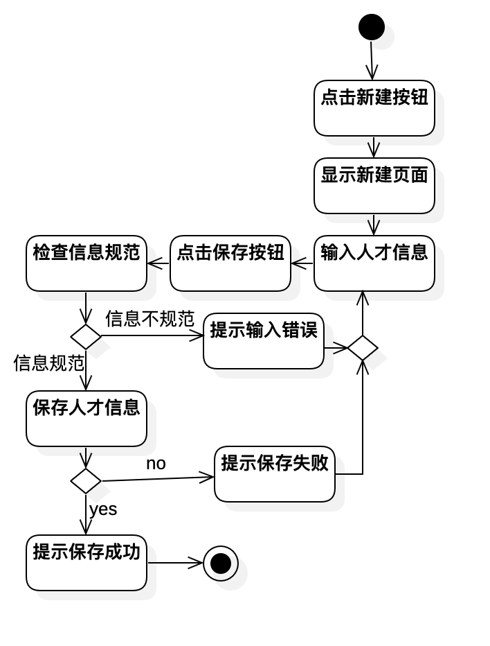

# 实验三：过程建模

## 1. 实验目标

- 掌握过程建模方法；
- 掌握活动图的画法。

## 2. 实验内容

- 观看教学视频；
- 使用StarUML绘制活动图；
- 撰写实验报告。

## 3. 实验步骤

- 观看视频，了解并掌握活动图的基本图形及其用法；
- 在StarUML上创建活动图并添加始末结点；
- 根据实验二的用例规约添加动作及决策点；
- 控制信息流的走向；
- 结合用例规约检查活动图；
- 编写实验报告

## 4. 实验结果

图1. 录入人才简历信息活动图

图2. 查询人才简历信息活动图

图3. 修改人才简历信息活动图