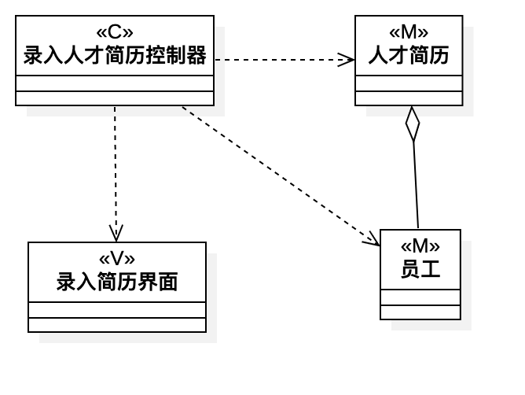
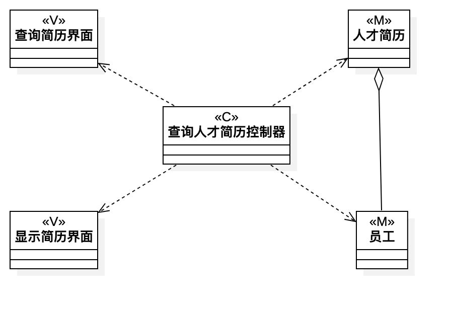
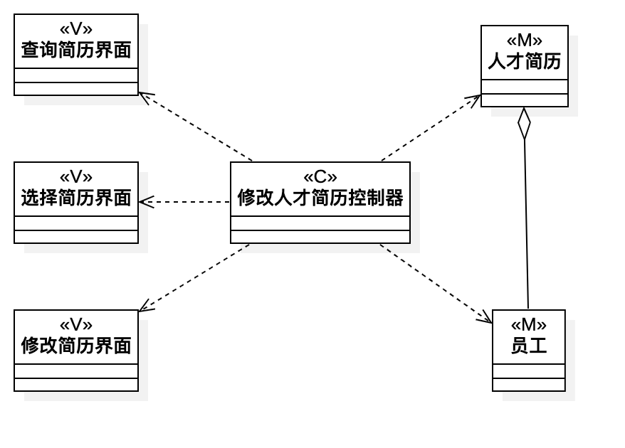

# 实验四 & 五：类建模

## 实验目标

- 掌握类建模方法；
- 了解MVC或你熟悉的设计模式；
- 掌握类图(Class Diagram)的画法。

## 实验内容

- 基于MVC模式设计类；
- 设计类的关系并画出类图。

## 实验步骤

- 观看教学视频，了解Class Diagram的基本图形及用法；
- 根据实验二用例规约找出类(Model、View、Controller)；
- 用线连接各个类表示它们之间的关系；
- 编写实验报告。

## 实验结果
  
图1.录入人才简历类图

  
图2.查询人才简历类图

  
图3.修改人才简历类图