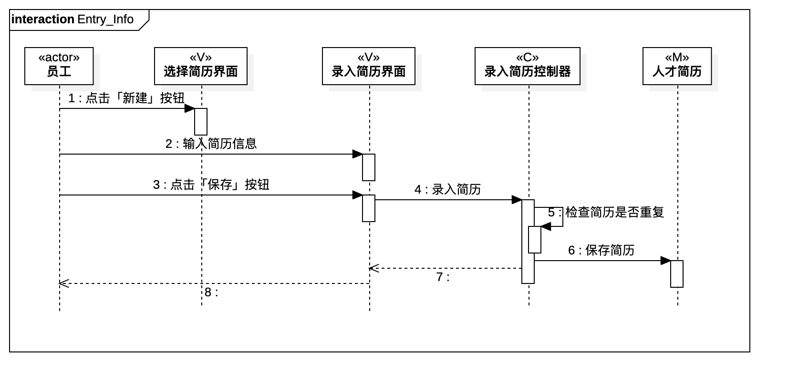
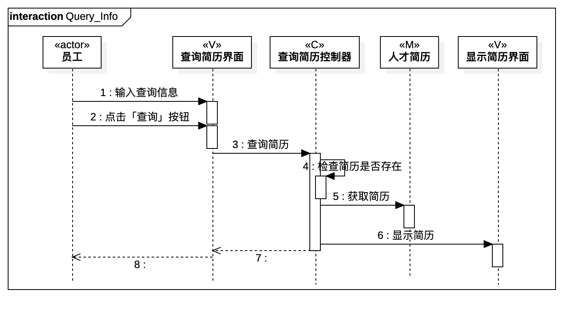
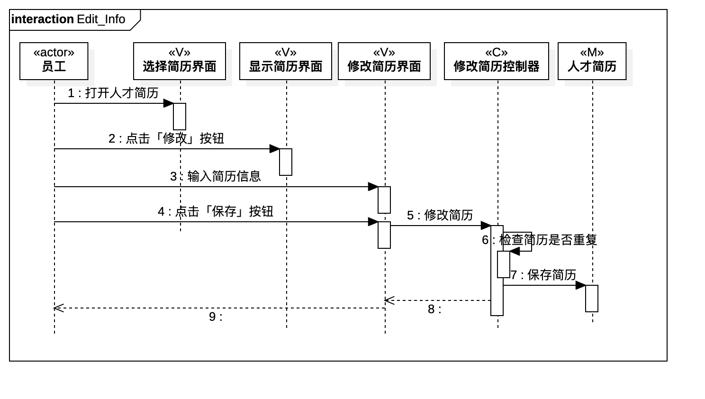

# 实验六：交互建模

## 1.实验目标
- 理解系统交互；
- 掌握UML顺序图的画法；
- 掌握对象交互的定义与建模方法。

## 2. 实验内容
- 根据用例模型和类模型，确定功能所涉及的系统对象；
- 在顺序图上画出参与者（对象）；
- 在顺序图上画出消息（交互）；

## 3. 实验步骤
- 观看教学视频，了解Sequence Diagram的基本图形及用法；
- 了解顺序图的构成、「时间顺序」的概念；
- 了解顺序图的「对象交互」以及参与者的「存活条」；
- 了解各种箭头对应的消息类型；
- 从Class Diagram中找到以下参与者：

   #### a. 录入人才简历信息
   员工（actor）、选择简历页面（V）、录入简历页面（V）、录入简历控制器（C）、人才简历（M）

   #### b. 查询人才简历信息
   员工（actor）、查询简历页面（V）、显示简历页面（V）、查询简历控制器（C）、人才简历（M）

   #### c. 修改人才简历信息
   员工（actor）、显示简历页面（V）、选择简历页面（V）、修改简历页面（V）、修改简历控制器（C）、人才简历（M）

- 根据活动图，按照顺序建立所有的Messages
- 在需要的位置建立Reply Messages

## 4. 实验结果

  
图1. 录入简历的顺序图

  
图2. 查询简历的顺序图

  
图3. 修改简历的顺序图
