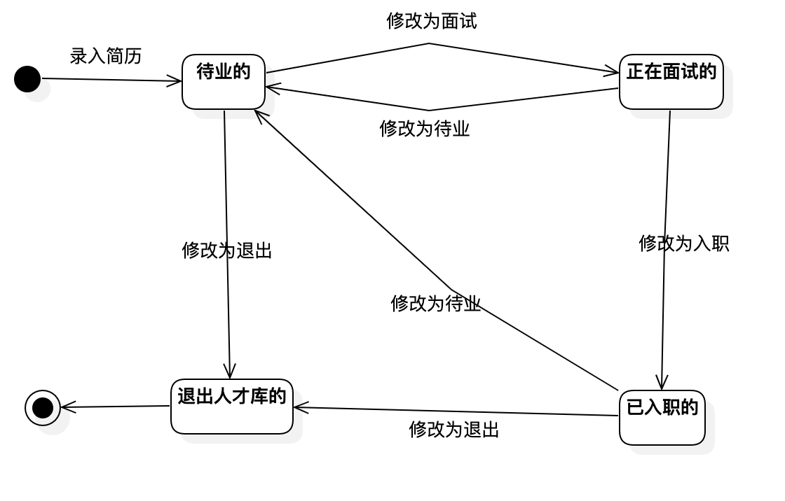

# 实验七：状态建模

## 一、实验目标

- 掌握对象状态建模（状态图，Statechart）

## 二、实验内容

- 根据用例图、用例规约、活动图、类图、顺序图，确定关键对象
- 画出状态图

## 三、实验步骤

- 观看教学视频，了解Statechart Diagram的基本图形及用法；
- 根据用例图、用例规约、活动图、类图、顺序图，确定关键对象：简历
- 找出对象攻略的相关状态：
    已入职的、待业的、正在面试的、退出人才库的
- 添加“Initial State”、“Final State”、“Simple State”
- 确定各状态之间的转换
- 保存状态图并提交至GitHub

## 四、实验结果

图1：简历的状态图