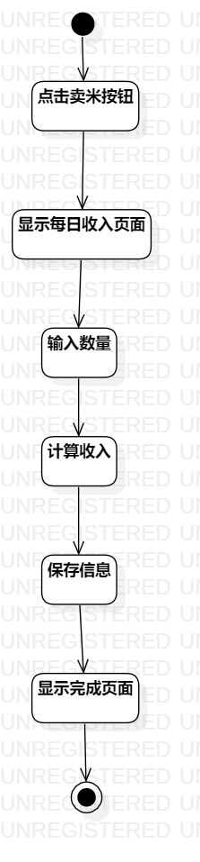
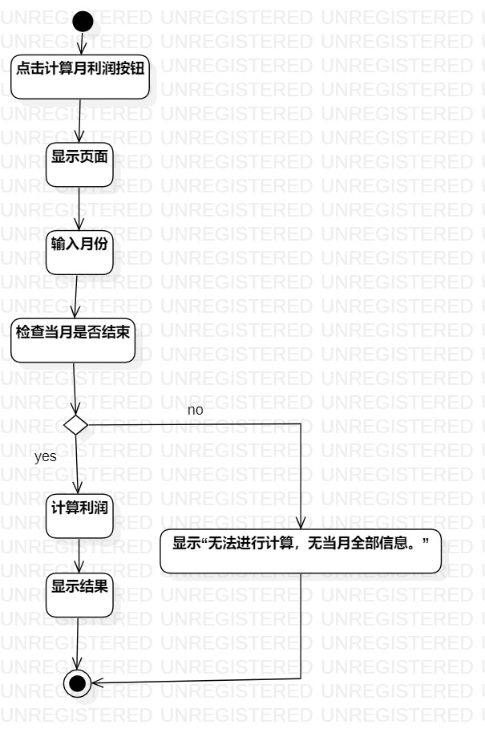

# UML实验三：过程建模

## 1、实验目标
1.1、掌握过程建模方法

1.2、掌握活动图的画法（Activity Diagram）
## 2、实验内容
2.1、根据实验二中的用例规约，利用StarUML画出活动图
## 3、实验步骤
3.1、在StarUML上创建 录入新英雄人物资料和搜索英雄 活动图

3.2、添加initial和final

3.3、根据用例规约添加action

3.4、在扩展流程的部分添加decision

3.5、用Merge将分支合回一路

3.6、用control flow连接起来

3.7、调整各部分位置，保持图简洁美观

3.8、导出活动图为图片（Lab3_ActivityDiagram1、Lab3_ActivityDiagram2、Lab3_ActivityDiagram3）

3.9、pull本地磁盘文件和Push到自己GitHub仓库中

3.10、编写实验报告
## 4、实验结果

图1.记录进米的花销的活动图

图2.记录卖米的收入的活动图

图3.计算每月的利润的活动图
