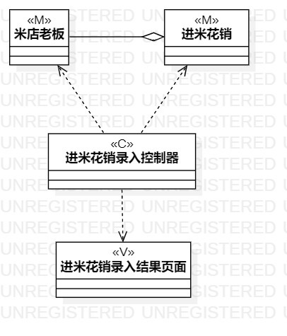
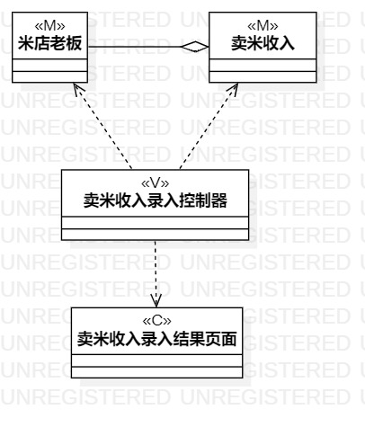
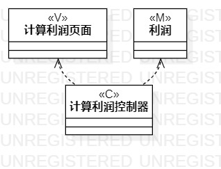

# 实验四五 类建模

## 一、实验目标
	1、掌握类建模方法；
	2、了解MVC的设计模式；
	3、掌握类图的画法。（Class Diagram）
## 二、实验内容
	1、学习类图的知识
	2、画出实验二两个用例的类图
	3、完成实验报告
## 三、实验步骤
1、画类图
         （1）在model下创建一个 class Diagrame
         （2）选取class
         （3）输入M层的相关实体
         （4）修改stereotype的值为M（完成M层后）
         （5）选取class
         （6）输入C层控制器
         （7）修改stereotype的值为C
         （8）选取class
         （9）输入V层控制器
         （10）修改stereotype的值为V
2、书写实验报告
## 四、实验结果

  

图一：记录进米花销

  

图二：记录卖米收入

  
图三：计算卖米收入
