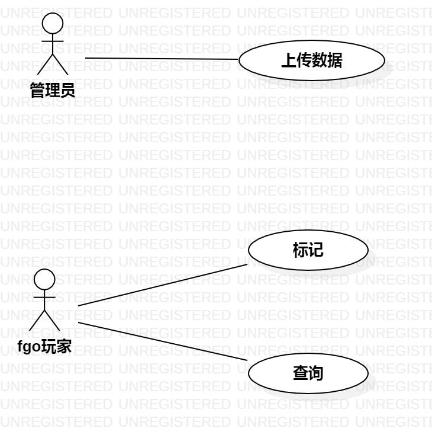

# 实验二

## 1.实验目标

1.学习markdown语法

2.熟悉用例图概念及画法

3.学会用例规约表格的编写

## 2.实验内容

1.细化功能需求。 

2.画出用例图（Use Case Diagram）。 

3.编写用例规约（表格）。 

## 3.实验步骤

1.确定主题：fgo英灵管理系统

2.确认参与者：A.管理员     B.fgo玩家

3.确认系统功能：
A.上传数据：管理员添加角色数据 
B.标注角色：fgo玩家标注已有角色
C.查询角色：fgo玩家查询已有角色
D.浏览角色：fgo玩家浏览全部角色

4.确定用例：A.上传数据  B.标注角色  C.查询角色

5.编写用例规范

## 4.实验结果

图一：fgo英灵管理系统的用例图

## 表1：添加角色数据用例规约  

用例编号  | FGO201 | 备注  
-|:-|-  
用例名称  | 添加角色数据  |   
前置条件  | 管理员登录系统    | *可选*   
后置条件  | 系统导入数据     | *可选*   
基本流程  | 1.管理员点击“添加数据”按钮  |*用例执行成功的步骤*    
~| 2.系统显示上传页面  |   
~| 3.管理员输入数据   |   
~| 4.管理员点击“确认添加”按钮   |   
~| 5.系统查询输入是否规范，如果规范，系统导入数据   |   
~| 6.系统提示添加成功   |  
扩展流程  | 5.1 系统发现输入不符合规范，系统提示输入错误   |*用例执行失败*    

## 表2：标注角色用例规约  

用例编号  | FGO202 | 备注  
-|:-|-  
用例名称  | 标注角色  |   
前置条件  |  fgo玩家登录系统    | *可选*   
后置条件  |  系统提示标注成功    | *可选*   
基本流程  | 1.fgo玩家点击任意角色  |*用例执行成功的步骤*    
~| 2.系统显示该角色页面  |   
~| 3.fgo玩家点击“标注”按钮   |   
~| 4.系统查询角色是否被标注，如果未标注，系统标注角色   |    
~| 5.系统提示标注成功   |   
扩展流程  | 4.1 系统发现角色已被标注，系统提示“已经标注”  |*用例执行失败*    

## 表3：查询角色用例规约  

用例编号  | FGO203 | 备注  
-|:-|-  
用例名称  | 查询角色  |   
前置条件  | fgo玩家登陆系统，进入“已有英灵”界面     | *可选*   
后置条件  | 系统显示被查询角色的页面     | *可选*   
基本流程  | 1.fgo玩家输入需要查询的角色名字并点击“查询”按钮  |*用例执行成功的步骤*    
~| 2.系统查询输入名字是否正确，如果正确，系统查询角色信息  |    
~| 3.系统显示被查询角色的页面  |    
扩展流程  | 2.1 系统发现输入名字错误或输入为空，系统提示“未拥有这名英灵”  |*用例执行失败*    