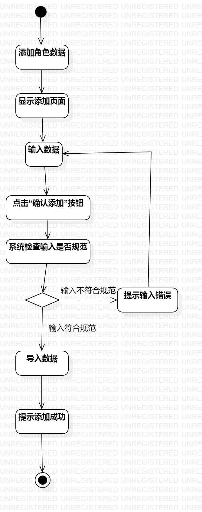
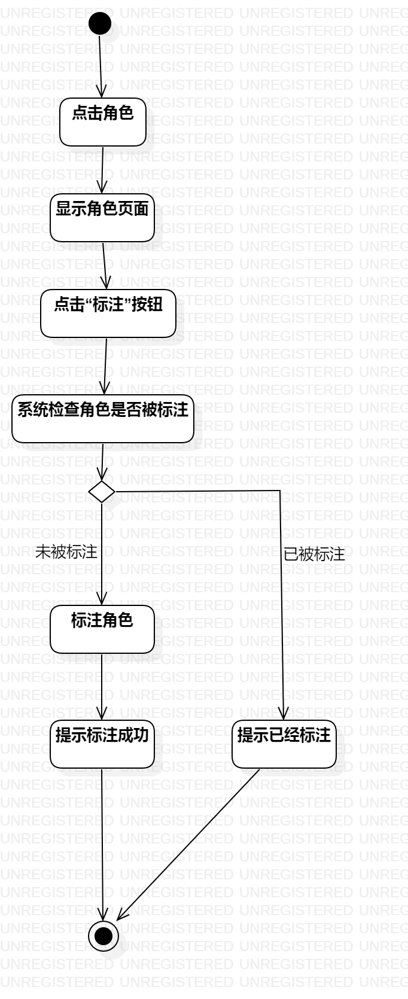
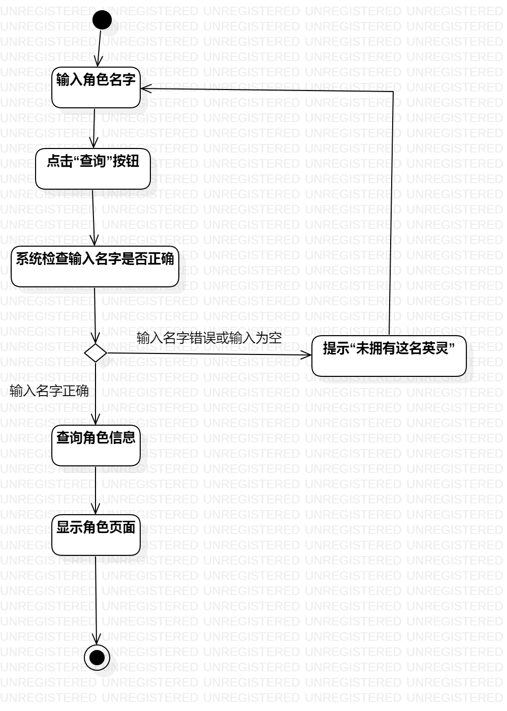

# 实验三：过程建模

## 一、实验目标

1.掌握过程建模方法；

2.掌握活动图的画法。（Activity Diagram）

## 二、实验内容

1.观看老师发布的视频

2.根据实验二编写的用例规约创建活动图

## 三、实验步骤

1.添加活动图

2.添加起点和终点

3.根据实验二编写的用例规约添加action

4.添加相应的决策点并连线

5.编写实验三实验报告

## 四、实验结果

图一：添加数据的活动图

图二：标注角色的活动图

图三：查询角色的活动图