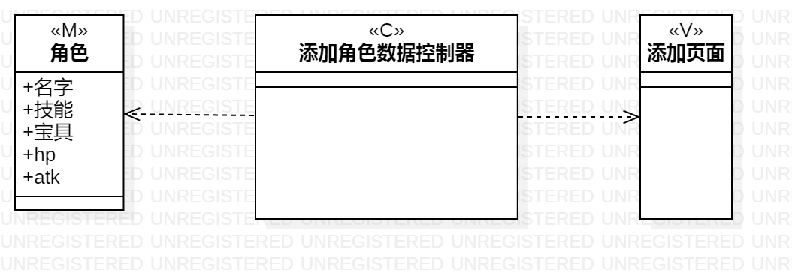
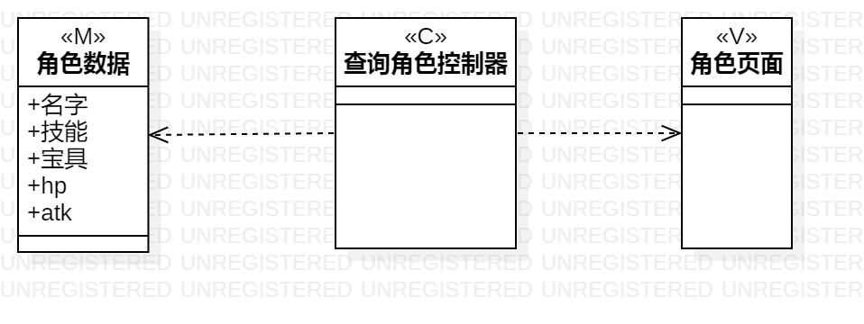

# 实验四：类建模  

# 实验五：高级类建模

## 实验目标

1.掌握类建模方法；

2.了解MVC或你熟悉的设计模式；

3.掌握类图的画法。（Class Diagram）

4.理解类的5种关系；

5.掌握类之间关系的画法。（Class Diagram）

## 实验内容

1.基于MVC模式设计类；

2.设计类的关系；

3.画出类图。

##实验步骤

1.观看老师上传的视频

2.确定lab2中的用例规约中哪些属于类

3.绘制uml图

4.编写试验报告

## 上课笔记内容

1.模型：实体、数据

2.视图：界面、AbcUI

3.控制器：系统、controller、service

4.类的关系由弱至强：依赖（虚线箭头）、包含（实线）、聚合（实线空心菱形）、组合（实线实心菱形）、继承（直线空心三角箭头）

5.四种常见符号：公开（+）、可被继承的（#）、包（~）、私有（-）

## 实验结果

图一：添加角色数据的类图

图二：标注角色的类图

图三：查询角色的类图