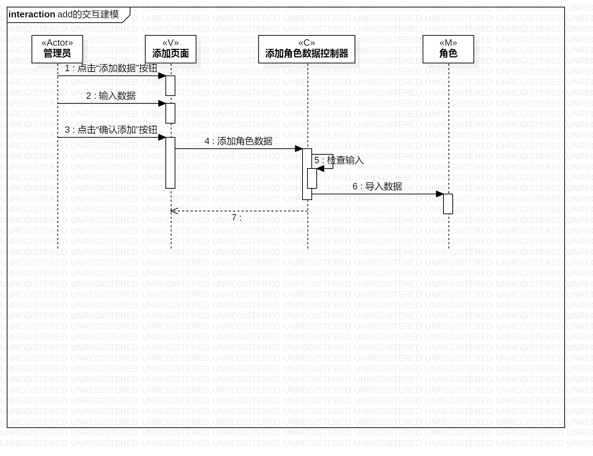
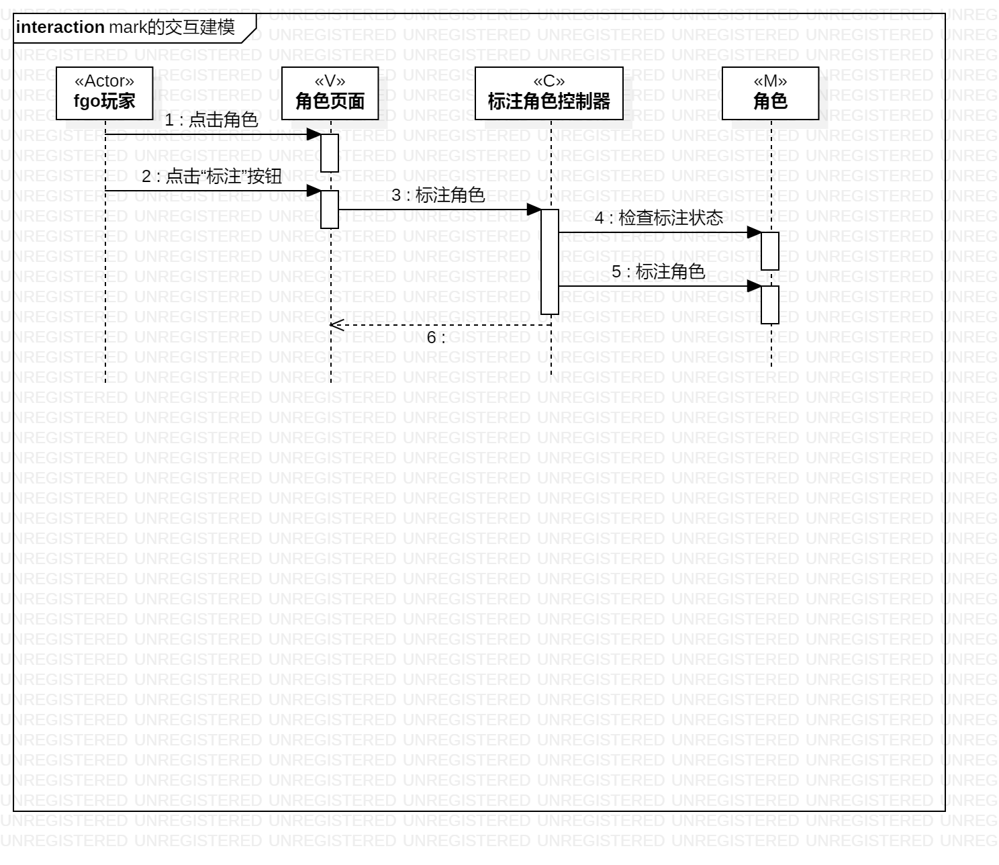
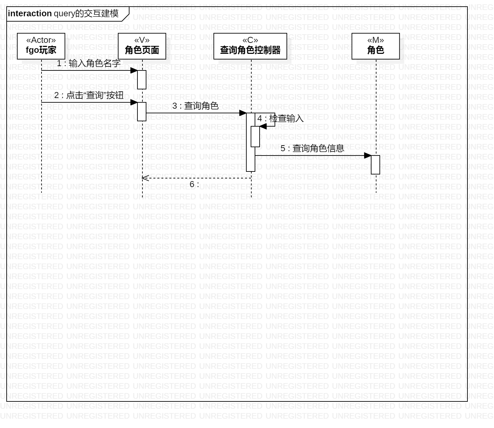

# 实验六 交互建模

## 实验目标

1.理解系统交互；

2.掌握UML顺序图的画法；

3.掌握对象交互的定义与建模方法。

## 实验内容

1.根据用例模型和类模型，确定功能所涉及的系统对象；

2.在顺序图上画出参与者（对象）；

3.在顺序图上画出消息（交互）。

##实验步骤

1.观看老师上传的视频

2.对照用例规约、活动图和类图绘制交互建模

3.编写试验报告

## 上课笔记内容

顺序图的画法：

1.从用例图找到第一个参与者（Actor）

2.从类图找到N个参与者，总共N+1个参与者1

3.从活动图找到操作步骤，画出参与者之间的消息

## 实验结果

图一：添加角色数据的顺序图

图二：标注角色的顺序图

图三：查询角色的顺序图
