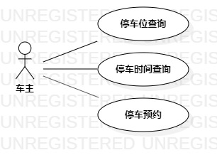

# 实验二：用例建模

## 一. 实验目标
1.使用Markdown写报告  
2. 选题并用例建模  
3. 学会编写用例规约

## 二. 实验内容
1. 在GitHub使用Markdown修改实验一报告
2. 在StarUML中画建模用例图
3. 在文档中编写用例规约
4. 提交实验二报告

## 三. 实验步骤
1. 确定选题为停车场管理系统
包括功能：  
(1). 停车位查询：用户通过该系统，对当前停车场停车位的空满情况进行查询。  
(2). 停车计时：已停车用户通过该系统，对所停车辆停车时间进行查询。  
(3). 停车预约：用户通过该系统，对相应的停车位进行预约，在有空位后接收到提示。  
2. 在StarUML上画用例图  
(1). 创建参与者"车主"。  
(2). 创建三个用例。  
(3). 建立"车主"与用例的关系。  
3. 编写用例规约。  
4. 完成实验二报告
5. 提交报告

## 四. 实验结果

  
停车场系统的用例图

## 表1：查询停车位用例规约

用例编号  | UC01 |   
-|:-|  
用例名称  | 查询停车位  |   
前置条件  |  车主进入查询页面  |    
后置条件  |      |    
基本流程  | 1.车主输入停车位号，点击"查询"按钮；  |    
~| 2.系统记录并搜索停车位号；   |
~| 3.系统定位停车位号对应车位；   |
~| 4.系统检测停车位空闲情况；   |
~| 5.系统显示停车位信息；   |     
扩展流程  | 2.1系统检测到停车位号输入非法，提示"所查询停车位号输入非法"。  |

## 表2：查询停车时间用例规约  

用例编号  | UC02 |   
-|:-|  
用例名称  | 查询停车时间  |   
前置条件  |  车主进入"我的车辆"界面  |    
后置条件  |      |    
基本流程  | 1.车主点击"查询停车时间"按钮"；  |   
~| 2.系统检测到车主在停车位中有车；  |    
~| 3.系统查询车辆停放信息；  |   
~| 4.系统显示车辆已停时间；   |   
扩展流程  | 2.1系统检测到车主在停车位无车，提示"您暂无车辆在停车位停放，无法查询"。  |

## 表3：停车预约用例规约  

用例编号  | UC03 |   
-|:-|  
用例名称  | 停车预约  |   
前置条件  |  车主进入停车预约页面  |   
后置条件  |      |    
基本流程  | 1.车主点击'预约"按钮；  |   
~| 2.系统检测到停车位有空余；  | 
~| 3.车主选择并点击可预约车位；  | 
~| 4.系统记录车主所选车位并变更车位状态为"已被预约"；   |
~| 5.系统显示"预约成功"；  |
扩展流程  | 2.1系统检测到停车位无空余位置，提示"当前无停车位可预约"；  |

