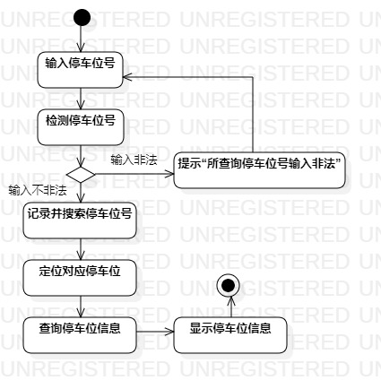
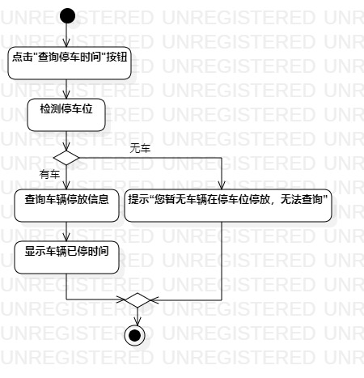
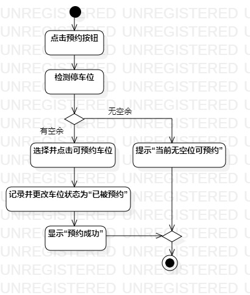

# 实验三：过程建模

## 一、实验目标
1. 理解活动用例元素
2. 掌握过程建模方法；
3. 掌握活动图（Activity Diagram）的画法。
## 二、实验内容
1. 使用StarUML根据lab2中编写的用例规约画活动图
## 三、实验步骤
1. 观看老师所发实验视频了解活动用例
2. 使用StarUML新建活动图（Add Diagram -> Activity Diagram）
2. 使用Activities(Basic)中的元素绘制用例活动图
3. 将绘制的活动图导出为.jpg图片
4. 编写Lab3报告
## 四、实验结果
  
图1：查询停车位的活动图

  
图2：查询停车时间的活动图

  
图3：停车预约的活动图
## 五、实验心得
  首先还是要看老师给的视频，了解所做的是什么东西，对SarUML中的元素  
  要搞清楚各自的含义，其次还有对作图不理解的地方可以参考其他同学成  
  功的例图，同时还要分析其他同学失败的例例图，对比自己所做的是否完  
  整，最后完成自己的作图与报告。
