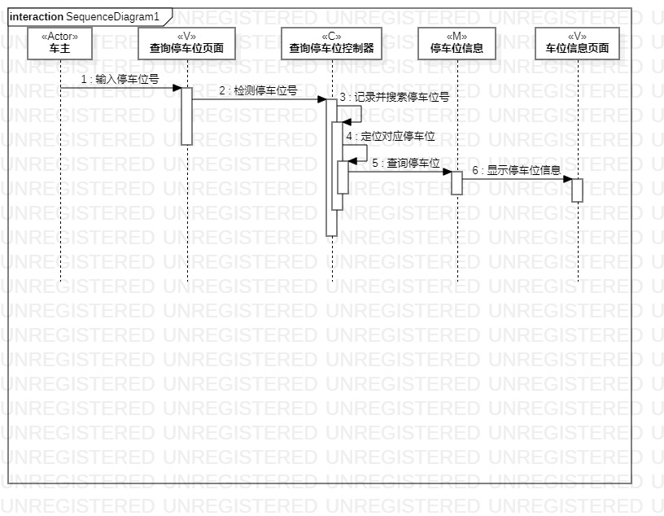
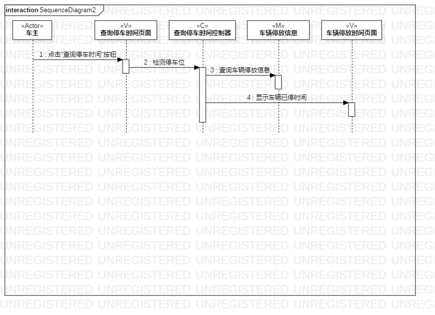
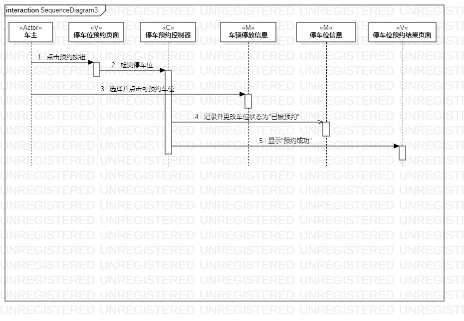

# 实验六：交互建模

## 一、实验目标
1. 理解系统交互  
2. 掌握UML顺序图的画法  
3. 掌握对象交互的定义与建模方法  

## 二、实验内容
1.根据用例模型和类模型，确定功能所涉及的系统对象。
2.在顺序图上画出参与者（对象）。
3.在顺序图上画出消息（交互）。

## 三、实验步骤
1. 观看老师所发视频了解顺序图的知识。    
2. 分析其他同学顺序图画法。  
3. 分析自己的用例图及活动图。  
4. 绘制三张活动图。  
5.编写实验报告。  

## 四、实验结果  
  
图1：查询停车位顺序图  
  
图2：查询停车时间顺序图    
  
图3：预约停车位顺序图  
