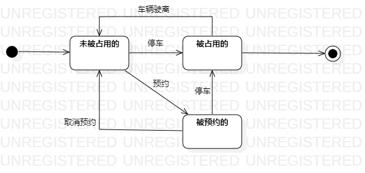

# 实验七

## 一、实验目标

1. 掌握对象状态建模

## 二、实验内容

1.寻找一个关键的对象；  
2.设计该对象的关键状态；  
3.设计状态之间的转变条件。  

## 三、实验步骤
1.观看老师所发视频，理解状态图。  
2.对自己选题进行分析。    
(1) 寻找关键对象 ：停车位  
(2) 设计该对象的关键状态：
- 未被占用的  
- 已被占用的  
- 已被预约的 

(3) 描述状态间的转变条件 

3.上传图片，编写实验报告。  
## 四、实验结果  

  
图1  停车位的状态图
