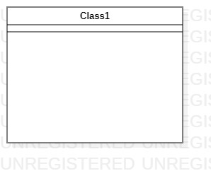

# 实验一

## 实验目标
1.学会在GitHub上提交实验

2.安装StarUML

3.完成选题以及功能描述

## 实验内容
1.下载并安装建模工具 StarUML，下载地址：http://staruml.io

2.确定个人建模选题，将选题填写在 Issues 中：

https://github.com/hzuapps/uml-modeling-2020/issues

## 实验结果

水果销售系统：

①水果提供商编辑库存

③水果需求方提交需求

