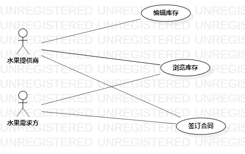

# 实验二：用例建模

## 一、实验目标
	1. 学会使用Markdown编写实验报告
	2. 选择个人建模选题
	3. 了解UML以及用例建模基本概念

## 二、实验内容
	1. 学习Markdown的特性并编写实验报告
	2. 学习UML以及用例建模的基本概念并完成用例建模
	3. 编写用例规约

## 三、实验步骤
	1. B站观看课程视频
	2. 在用例图中添加角色水果提供商和水果需求方
	3. 添加用例编辑库存和提交需求并连线
	4. 编写编辑库存和提交需求的用例规约

## 四、实验结果
 

图1：水果销售系统用例图

## 表1：编辑库存用例规约  

用例编号  | UC01 | 备注  
-|:-|-  
用例名称  | 编辑库存  |   
前置条件  |      | *可选*   
后置条件  |      | *可选*   
基本流程  | 1. 水果提供商点击编辑按钮；  |*用例执行成功的步骤*    
~| 2. 系统显示库存编辑页面；  |   
~| 3. 水果提供商输入库存，点击提交按钮；  |   
~| 4. 系统检查库存不包含负数，更新提供商的库存，提示“保存成功”；  |   
扩展流程  | 4.1 系统检查发现输入的库存包含负数，**提示“数据不正确”**；  |*用例执行失败*

## 表2：提交需求用例规约

用例编号  | UC02 | 备注  
-|:-|-  
用例名称  | 提交需求  |   
前置条件  |      | *可选*   
后置条件  |      | *可选*   
基本流程  | 1. 水果需求方点击采购按钮；  |*用例执行成功的步骤*    
~| 2. 系统显示采购需求填写页面；  |   
~| 3. 水果需求方输入需求，点击提交按钮；  |   
~| 4. 系统检查需求不包含负数，保存需求方的需求，提示“提交成功”；  |   
扩展流程  | 4.1 系统检查发现输入的需求数包含负数，提示**“数据不正确”**；  |*用例执行失败*  

  

