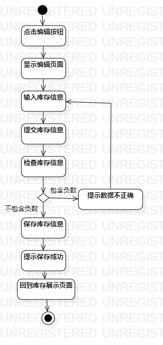
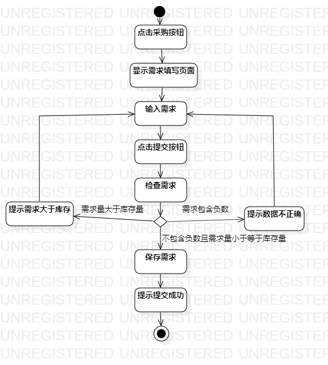

# 实验三：过程建模

## 一、实验目标
	1. 掌握过程建模方法
	2. 掌握活动图的画法

## 二、实验内容
	1. 学习过程建模概念及活动图概念
	2. 学习活动图画图的细节注意点
	3. 根据自己的用例画出活动图

## 三、实验步骤
	1. B站观看课程视频
	2. 画出“编辑库存”活动图
	3. 画出“浏览库存”活动图
	4. 画出“签订合同”活动图

## 四、实验结果
 

图1：编辑库存活动图

 

图2：浏览库存活动图

 

图3：签订合同活动图

