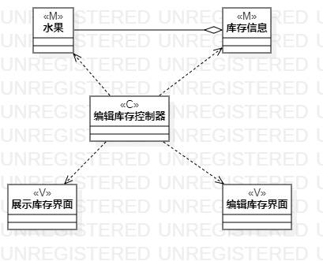
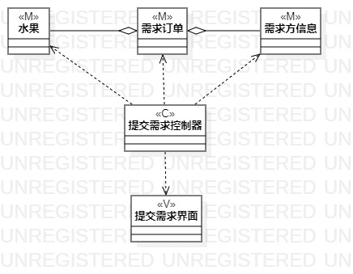

# 实验四、五：类建模

## 一、实验目标
	1. 掌握类建模方法
	2. 了解MVC或你熟悉的设计模式
	3. 掌握类图的画法

## 二、实验内容
	1. 基于MVC模式设计类
	2. 设计类的关系
	3. 画出类图

## 三、实验步骤
	1. B站观看课程视频
	2. 画出“编辑库存”类图
	3. 画出“提交需求”类图

## 四、实验结果
 

图1：编辑库存类图

 

图2：提交需求类图

