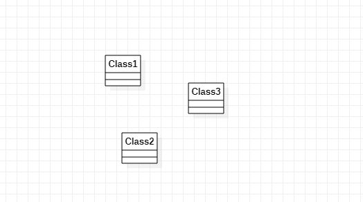

# 实验一

## 实验目标

1.熟悉GitHub实验过程。

2.安装和使用StarUML。

## 实验内容

1.安装GitHub并练习使用Git Bash。

2.安装StarUML并创建一个图。

3.在Issues创建自己的功能选题。

## 实验步骤

1.将自己GitHub账号下相对应课程克隆到本地，形成副本3。

2.学习掌握GitHub相关操作，并解决使用GitHub过程中出现的相关操作问题。

3.完成主库Issues下的功能选题“铁路同行人员查询系统”。

## 实验结果

