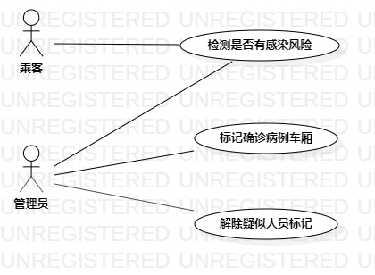

# 实验二

## 一、实验目标

1. 完成选题。

2. 细化需求。

3. 创建用例图。

4. 编写用例规约。

## 二、实验内容

1. 完成主库Issues下功能选题。

2. 介绍选题2-3功能点需求。

3. 使用StarUML创建用例图。

4. 编写用例规约。

## 三、实验步骤

1. 在主库下创建自己的选题并细化3个功能点需求https://github.com/hzuapps/uml-modeling-2020/issues/352

（1）选题题目：铁路同行人员查询系统

（2）功能需求：
- 乘客输入个人乘行信息检测自己是否与确诊病例同行，有感染风险。

- 管理员输入确诊病例乘行相关信息，标记并列出该车厢人员有感染风险。

- 管理输入已解除观察的疑似人员个人信息，解除标记。

2. 确定使用对象：管理员、乘客。

3. 使用StarUML画出功能需求用例图并同步至GitHub自身账号下。

4. 学习掌握用例规约并根据用例图编写用例规约。

## 四、实验结果

#### 用例图

  
图1：铁路同行人员查询系统用例图

#### 表1：检测感染用例规约  

用例编号  | Railway01 | 备注  
-|:-|-  
用例名称  | 检测感染  |   
前置条件  |      | *可选*   
后置条件  | 系统返回是否为疑似人员页面     | *页面返回乘客信息和是否为可疑人员*   
基本流程  | 1. 乘客点击检测链接；  |*用例执行成功的步骤*    
~| 2. 系统返回信息填写页面；  |   
~| 3. 乘客输入姓名、身份证号、乘车日期，点击“查询”按钮；  |   
~| 4. 系统根据输入信息查询该乘客的标记信息；  |   
~| 5. 系统显示乘行信息以及是否为疑似感染人员。  |  
扩展流程  | 3.1 系统检查发现输入信息与格式不符，提示“信息格式错误，请重新输入”；  |*用例执行失败*

#### 表2：标记车厢用例规约  

用例编号  | Railway02 | 备注  
-|:-|-  
用例名称  | 标记车厢  |   
前置条件  |      | *可选*   
后置条件  |  系统返回标记成功页面    | *可选*   
基本流程  | 1. 管理员点击后台管理链接；  |*用例执行成功的步骤*    
~| 2. 系统返回管理首页，管理员点击“标记”按钮；  |   
~| 3. 系统显示确诊乘客信息填写页面；  |   
~| 4. 管理员输入患者姓名、身份证号、乘车日期，点击“查询”按钮；  |   
~| 5. 系统查询到患者乘行相关信息；  |   
~| 6. 管理员点击“标记”按钮。  |  
~| 7. 系统根据患者乘车日期、车列号以及车厢号并该车厢全部乘客列为疑似人员，提示“操作成功”。  |  
扩展流程  | 4.1 系统检查发现输入信息与格式不符，提示“格式错误，请重新输入”；  |*用例执行失败*

#### 表3：解除标记用例规约  

用例编号  | Railway03 | 备注  
-|:-|-  
用例名称  | 解除标记  |   
前置条件  |      | *可选*   
后置条件  |  系统返回解除成功页面    | *可选*   
基本流程  | 1. 管理员点击程序进入后台管理并点击“解除”链接；  |*用例执行成功的步骤*    
~| 2. 系统返回管理首页，管理员点击“解除”按钮；  |   
~| 3. 系统显示信息填写页面；  |   
~| 4. 管理员输入乘客姓名、身份证号，点击“解除”按钮；  |   
~| 5. 系统根据信息将该乘客列为非疑似人员，提示“解除成功”。  |  
扩展流程  | 4.1 系统检查发现输入信息与格式不符，提示“格式错误，请重新输入”；  |*用例执行失败*
~| 5.1 系统检查发现乘客未被标记，提示“该乘客为非疑似人员，操作失败”。  |*用例执行失败*
