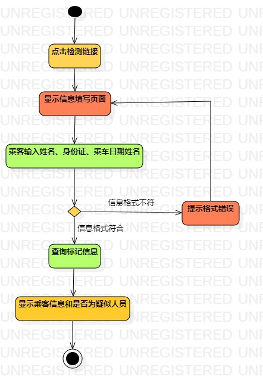
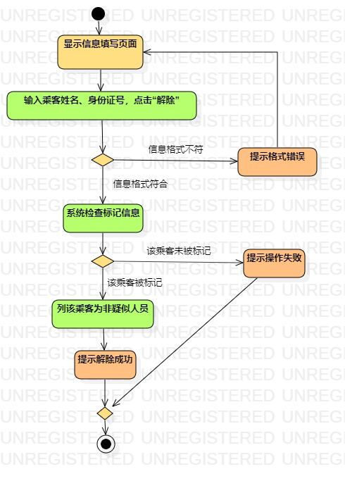

# 实验三

## 一、实验目标

1. 掌握过程建模方法；

2. 掌握活动图的画法。（Activity Diagram）

## 二、实验内容

1. 掌握过程建模方法；

2. 根据实验二用例规约画出活动图。

## 三、实验步骤

1. B站观看过程建模的概念以及实验3注意问题。

2. 使用实验二编写的用例规约，建立检测感染、标记车厢和解除标记的活动图。

3. 规范过程建模画图标准。

## 四、实验结果

#### 检测感染活动图

  
图1：检测感染活动图

#### 标记车厢活动图

  
图2：标记车厢活动图

#### 标记车厢活动图

  
图3：解除标记活动图
