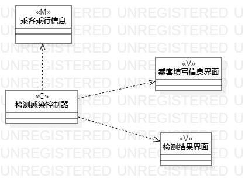
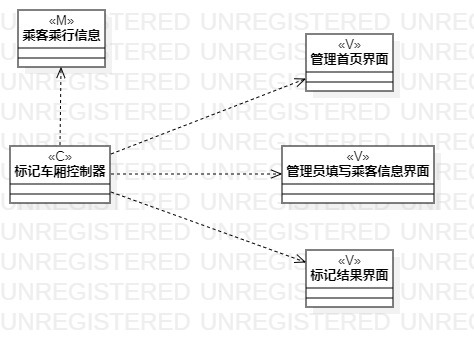
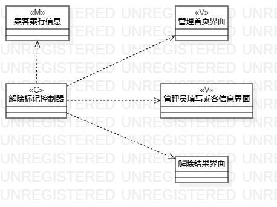

# 实验四&五 类建模&高级类建模

## 一、实验目标

1. 掌握类建模方法；

2. 了解MVC或你熟悉的设计模式；

3. 理解类的5种关系；

4. 掌握类之间关系的画法。（Class Diagram）

## 二、实验内容

1. 学习MVC模式并基于MVC模式设计类；

2. 设计类的关系；

3. 画出类图。

## 三、实验步骤

1. B站观看类建模的概念视频，总结实验3出现的问题以及实验45过程中要注意的问题。

2. 使用实验二编写的用例规约寻找相关类，并建立检测感染、标记车厢和解除标记的类图。

3. 理清类之间的dependency,association,aggregation,composition,inheritance强度关系以及优缺点。

4. 使用StarUML进行类建模并理清类之间的依赖关系，规范类的命名格式。

## 四、实验结果

#### 检测感染类图

  
图1：检测感染类图

#### 检测感染类图

  
图2：标记车厢类图

#### 检测感染类图

  
图3：解除标记类图
