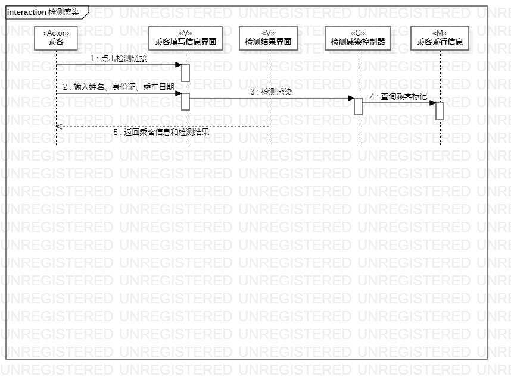
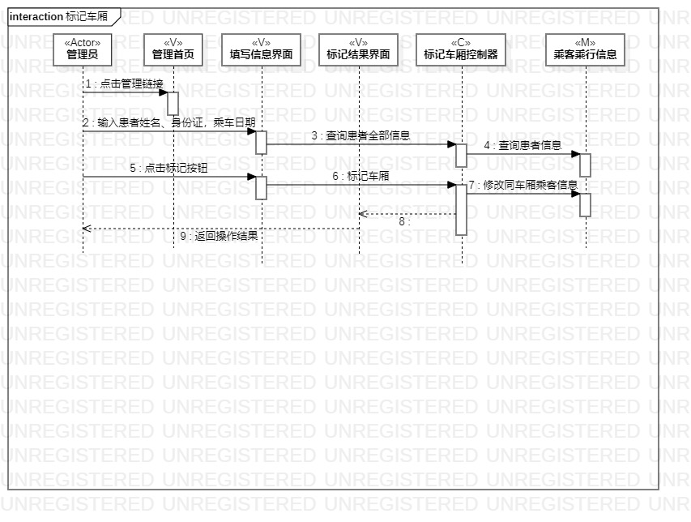
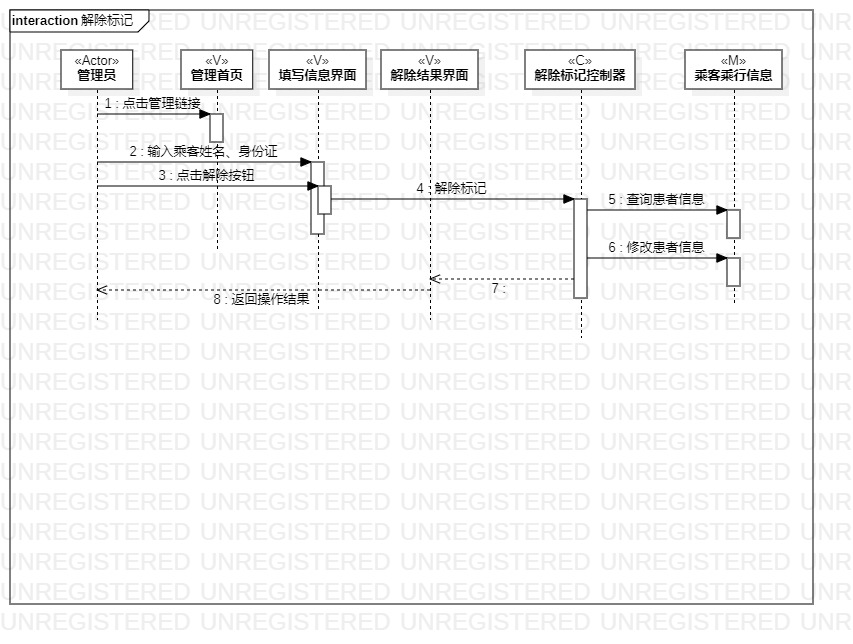

# 实验六

## 一、实验目标

1. 理解系统交互；

2. 掌握UML顺序图的画法；

3. 掌握对象交互的定义与建模方法。

## 二、实验内容

1. 根据用例模型和类模型，确定功能所涉及的系统对象；

2. 在顺序图上画出参与者（对象）；

3. 在顺序图上画出消息（交互）。

## 三、实验步骤

1. 观看实验45的总结视频，加深上次实验内容的理解。

2. 了解对象和顺序图的画法以及规则，理清自己选题中对象的交互行为。

3. 解决实验3活动图中忽略的问题，完善实验3活动图。

4. 结合用例规约和实验345等uml图，分析对象消息传送过程，绘制顺序图。

## 四、实验结果

#### 检测感染顺序图

  
图1：检测感染顺序图

#### 标记车厢顺序图

  
图2：标记车厢顺序图

#### 解除标记顺序图

  
图3：解除标记顺序图
