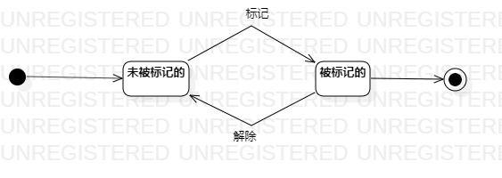

# 实验七  状态建模

## 一、实验目标

1. 掌握对象状态建模（状态图，Statechart）。

## 二、实验内容

1. 根据用例图、类图、顺序图等，确定功能所涉及的系统对象；

2. 在状态图上画出对象的状态变化；

## 三、实验步骤

1. 观看实验6的总结视频，加深上次实验内容的理解。

2. 了解对象和状态图的画法以及规则，理清自己选题中主要对象的状态变化。

3. 解决实验45类图中忽略的问题，完善实验45的类图。

4. 结合用例规约和实验3456等uml图，分析出主要对象在系统中的状态变化，绘制出该对象的状态图。

## 四、实验结果

#### 乘客状态图

  
图1：乘客的状态图

