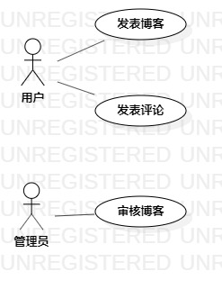

# 实验二：用例建模

## 1. 实验内容
1. 细化功能需求。
2. 画出用例图（Use Case Diagram）
3. 编写用例规约（表格）

## 2.实验要求
1. 给每一个功能点写一段描述（字数至少60字，3行）
2. 写清楚使用功能的用户
3. 说明该功能执行之后产生的结果
4. 用例规约必填：基本流程（成功执行用例的步骤）；扩展流程（引起用例失败的步骤）

## 3. 实验步骤

1. 确定选题（博客系统）
2. 确定角色（用户）
3. 确定用户功能（发表博客、发表评论)
4. 编写上述两个功能点的描述
5. 为上述两个功能点画出用例图
6. 编写上述两个功能的条例规约

## 4. 实验结果

1. 用户发表博客：用户进行登录后，点击个人中心按钮跳转至个人中心页面，点击发布博文按钮，进入发布博文页面。
在按提示填写发布博文所必须的信息后，点击发布按钮，等待服务器相应成功后即完成发布博文的操作；

2. 用户发表评论：用户进行登录后，在查看任意一篇博文时，可点击评论按钮，输入评论所需信息后，点击发布评论按钮，等待服务器相应成功后即完成发布评论操作；

  
图1：博客系统的用例图

##

## 表1：用户发表博文用例规约
用例编号 | UC01 | 备注 |
:- | :- | :- | 
用例名称 | 发表博文 | 
前置条件 | 无 | 
后置条件 | 无 | 
基本流程 | 1.用户点击发布博文按钮 |
~ | 2.系统检查用户已登录|
~ | 3.系统跳转发布博文页面 |
~ | 4.用户输入博文信息后点击发布按钮 |
~ | 5.系统检查必要信息已全部填写，保存博文信息 |
~ | 6.系统跳转博文列表 |
扩展流程 | 2.1 系统检查用户没有登录，提示“请先登录” | 发布博文失败 |
~ | 5.1 系统检查发现博文缺少必要信息，提示“必要信息没有填写完整” | 发布博文失败 |

## 表2：用户发表评论规约
用例编号 | UC02 | 备注 |
:- | :- | :- | 
用例名称 | 发表评论 | 
前置条件 | 无 | 
后置条件 | 无 | 
基本流程 | 1.用户点击发布评论按钮 |
~ | 2.系统检查用户已登录 |
~ | 3.系统跳转发布评论页面 |
~ | 4.用户输入评论信息后点击评论按钮 |
~ | 5.系统检查评论没有包含非法信息 |
~ | 6.系统检查博文存在，保存评论信息 |
~ | 7.系统跳转评论列表 |
扩展流程 | 2.1 系统检查用户没有登录，提示“请先登录” |　发表评论失败　|
~ | 5.1 系统检查发现评论出现非法信息，提示“评论出现非法信息” | 发表评论失败 |
~ | 6.1 系统检查博文不存在，提示“该博文不存在” | 发表评论失败 |