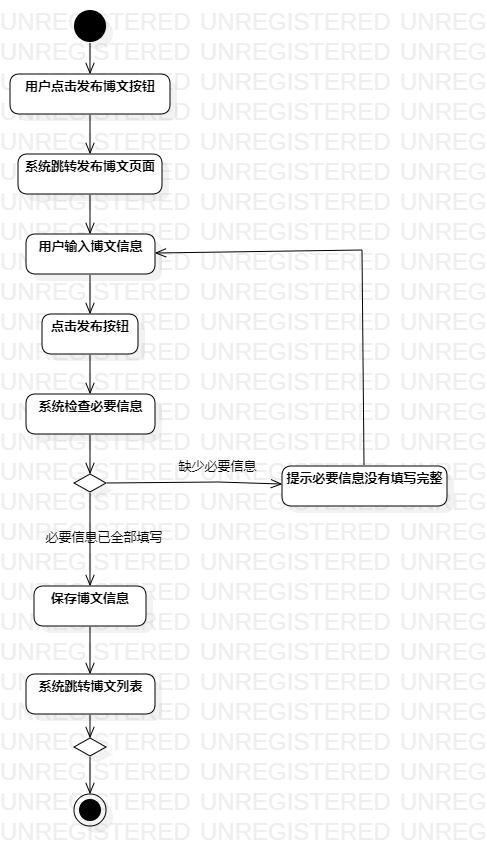
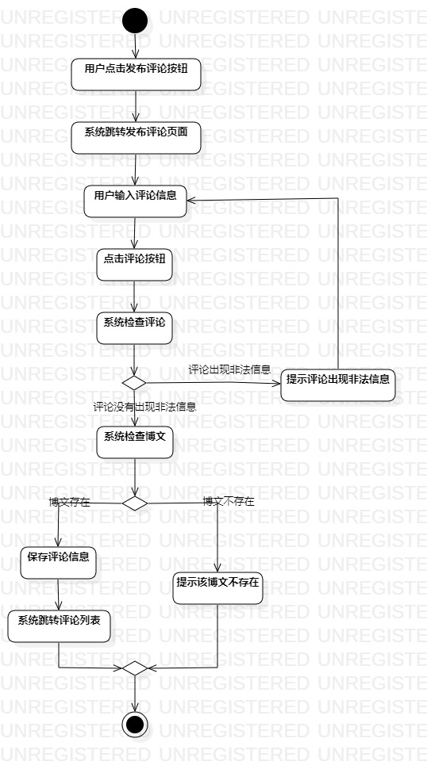

# 实验三：过程建模

## 1. 实验内容
1.掌握过程建模方法；

2.掌握活动图(Activity Diagram)的画法。

## 2.实验要求
1.根据用例规约画出活动图；

2.编写实验报告。

## 3. 实验步骤

1. 根据用例规约（发表博文、发表评论）确定活动图的活动和决策分支

2. 将活动、决策分支、开始结点和结束结点用Control flow进行连接

## 4. 实验结果

  
图1：发表博文活动图

  
图2：发表评论活动图