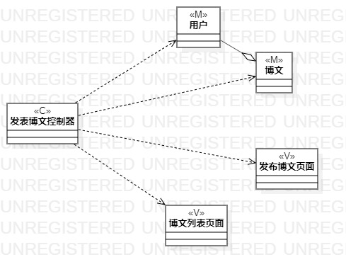
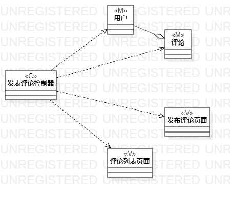

# 实验四&五：类建模&高级类建模

## 1.实验目标
1. 掌握类建模方法；
2. 了解MVC或你熟悉的设计模式；
3. 掌握类图的画法。（Class Diagram）
4. 理解类的5种关系；
5. 掌握类之间关系的画法。（Class Diagram）

## 2. 实验内容
1. 基于MVC模式设计类；
2. 设计类的关系；
3. 画出类图。

## 3. 实验步骤
1. 了解类、属性和操作的概念；
2. 了解4种可见性的符号；
   ##### Public:+; Protected:#; Package:~; Private:-;
3. 了解MVC设计模式；
   ##### Model + View + Controller
4. 根据用例规约设计：
   ##### （1） 发表博文
    - Model:      博文、用户
    - View：      发表博文控制器
    - Controller：发布博文界面、博文列表页面
   ##### （2） 发表评论
    - Model:      评论、用户、博文
    - View：      发表评论控制器
    - Controller：发布评论页面、评论列表页面、提示博文不存在页面

## 4. 实验结果

  
图1：发表博文的类图

  
图1：发表评论的类图