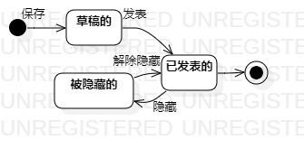

# 实验七：状态建模

## 1.实验要点
1. 寻找一个关键的对象；
2. 设计该对象的关键状态；
3. 对象的状态是：对象所表示的数据。如果数据发生变化，状态就是发生变化。
4. 描述状态：形容词。
5. 订单： 新的（New）、已付款的、取消的、已发货的、已签收的、退货中的、 完成的。
6. 设计状态之间的转变条件。

## 3. 实验步骤
1. 了解状态图概念；
2. 确定系统重要对象：
   #### 博客；
3. 确定对象状态：
   #### 草稿的、被隐藏的、已发表的；
4. 确定状态间转换条件；

## 4. 实验结果

  
图1：发表博文的状态图
