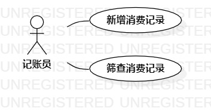

# 实验二：用例建模

## 一. 实验目标
1. 确定系统功能需求  
2. 掌握用例的概念  
3. 学习使用starUML画用例图

## 二. 实验内容
1. 提交选题及说明功能；
2. 画出选题相关的用例图；
3. 使用用例规约说明用例。

## 三. 实验步骤
1. 创建选题：记账本
2. 确认选题针对的用户：记账员
3. 明确所选题目的用例：新增消费记录和筛查消费记录
4. 使用starUML软件画出用例图
5. 编写用例规约

## 四. 实验结果

  
图一. 记账本系统的用例图

### 表一：新增消费记录用例规约

用例编号  | UC01 | 备注  
-|:-|-  
用例名称  | 新增消费明细  |   
前置条件  |      | *可选*   
后置条件  |      | *可选*   
基本流程  | 1.记账员点击新增按钮  |    
~| 2. 系统弹出新增消费记录界面  |   
~| 3. 记账员填入所有消费记录项，点击确认按钮  |   
~| 4. 系统检查所有消费记录项已填入，保存消费记录  |    
扩展流程  | 4.1 系统检查未填入所有消费记录项，系统提示本次新增失败 | *用例执行失败*     

### 表二：筛查消费记录用例规约

用例编号  | UC02 | 备注  
-|:-|-  
用例名称  | 筛查消费记录  |   
前置条件  |      | *可选*   
后置条件  |      | *可选*   
基本流程  | 1.记账员点击筛查按钮  |    
~| 2. 系统弹出筛查消费记录界面  |   
~| 3. 记账员选择筛查日期，点击确认按钮  |   
~| 4. 系统查找对应日期消费记录  |  
~| 5. 系统检查发现有消费记录，显示在屏幕上  | 
扩展流程  | 5.1 系统检查发现无消费记录，提示本日无消费记录 | *用例执行失败* 
