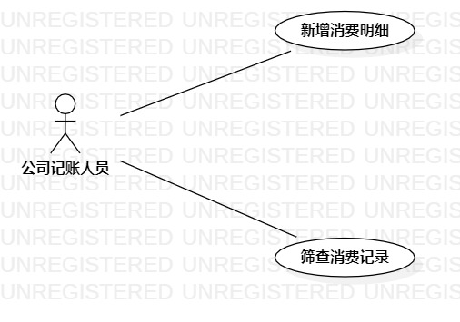

# 实验二：用例建模

## 一. 实验目标
1. 确定系统功能需求  
2. 掌握用例的概念  
3. 学习使用starUML画用例图

## 二. 实验内容
1. 提交选题及说明功能；
2. 画出选题相关的用例图；
3. 使用用例规约说明用例。

## 三. 实验步骤
1. 创建选题：记账本
2. 确认选题针对的用户：公司记账人员
3. 明确所选题目的用例：新增消费明细和筛查消费记录
4. 使用starUML软件画出用例图
5. 编写用例规约

## 四. 实验结果

  
图一. 记账本系统的用例图

### 表一：新增消费明细用例规约
