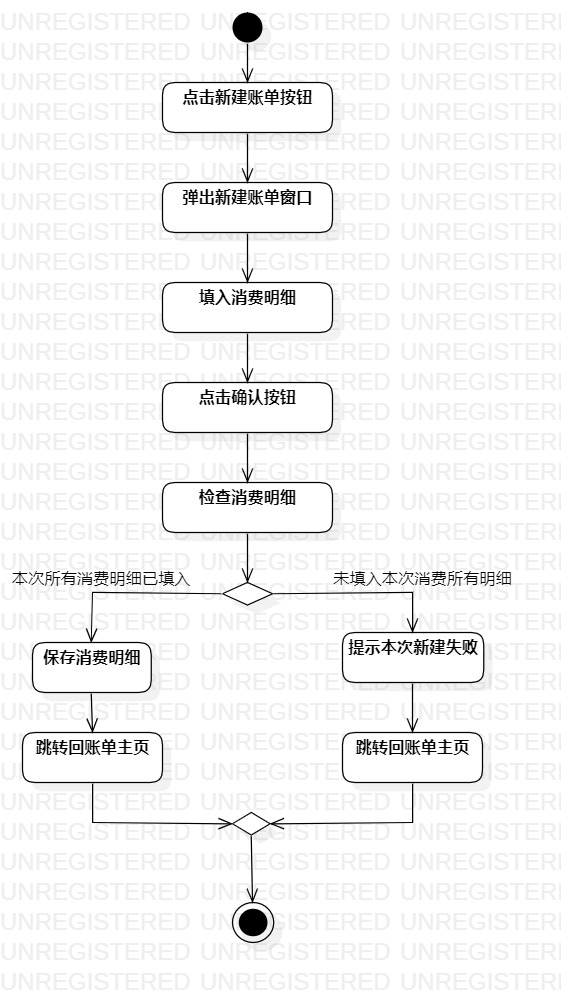
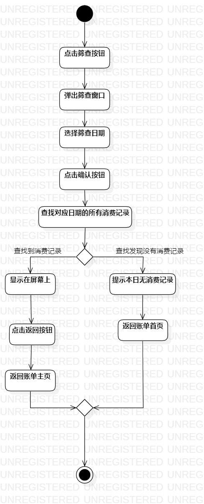

# 实验三：过程建模

## 实验内容
1. 掌握过程建模方法；  
2. 掌握活动图的画法。

## 实验要求
1. 参照实验2中的用例规约图
2. 在StarUML软件中绘制出系统活动图

## 实验步骤
1. 创建新增消费记录和筛查消费记录的活动图  
2. 使用正确的node符号，action符号和control flow画出活动图
3. 编写实验报告

## 实验结果

  
图1：新增消费记录活动图

  
图2：筛查消费记录活动图
