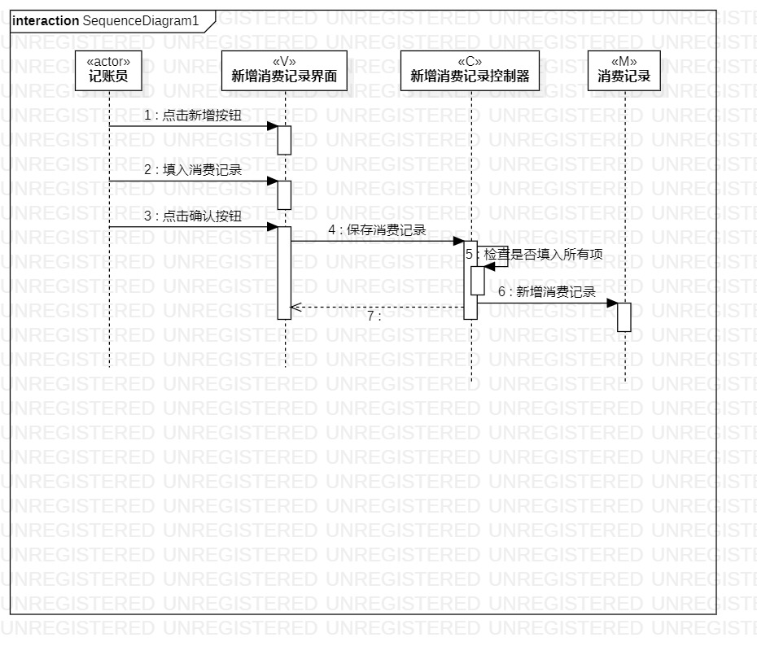
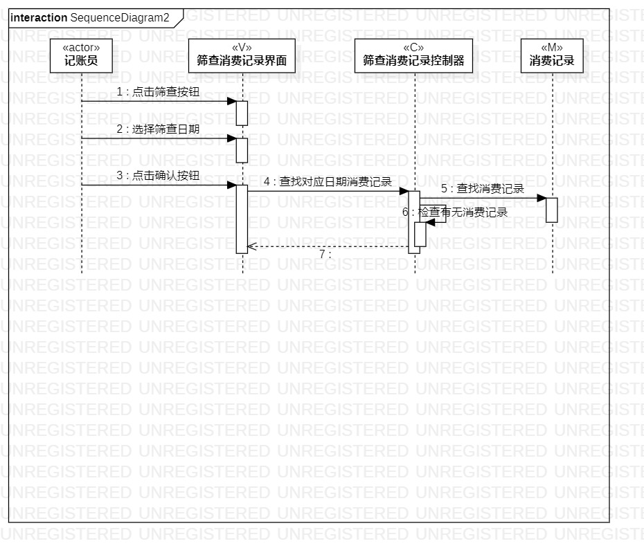

# 实验六 交互建模

## 实验目标
1. 理解系统交互；
2. 掌握UML顺序图的画法；
3. 掌握对象交互的定义与建模方法。

## 实验内容
1. 根据用例模型和类模型，确定功能所涉及的系统对象；   
2. 在顺序图上画出参与者（对象）；  
3. 在顺序图上画出消息（交互）。  

## 实验步骤
1. 修改前面所有实验图
2. 根据用例规约和类图画出系统交互图
3. 编写实验报告

## 实验结果
  
图1.新增消费记录交互图

  
图2.筛查消费记录交互图
