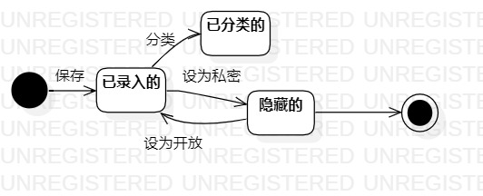

# 实验七 状态建模

## 实验目标
1. 掌握对象状态建模（状态图，Statechart）。

## 实验要点
1. 寻找一个关键的对象；  
2. 设计该对象的关键状态；  
3. 设计状态之间的转变条件。  

## 实验步骤
1. 确定消费记录作为关键对象；  
2. 设计该对象的关键状态（已录入的，已分类的，隐藏的）；  
3. 将状态连接起来，并填写状态之间的转变条件；  
4. 编写实验报告。

## 实验结果
  
图1.消费记录状态图
