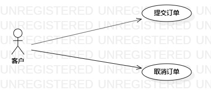

# 实验二：用例建模

## 一丶实验目标

1.学会使用Markown编写实验报告

2.掌握用例建模

## 二、实验内容

1.将个人选题提交到Issue

2.用Markdown编写实验报告

3.用StarlUml完成用例建模

## 三、实验步骤

1.提交个人选题：饭店点餐系统

2.确定参与者:

  - 客户
  
3.确定实例:

  - 提交订单
  - 取消订单
  

4.完成用例图

5.编写用例规范

## 四、实验结果

  
图1:饭店点餐系统用例图

## 表1：饭店点餐用例规约  

用例编号  | UC01 | 备注  
-|:-|-  
用例名称  | 添加预约  |   
前置条件  |      | *可选*   
后置条件  |      | *可选*   
基本流程  | 1. 客户选择商品;  |*用例执行成功的步骤*    
~| 2. 系统显示饭店商品;  |   
~| 3. 客户选择商品;   |   
~| 4. 系统保存选择的商品信息;   |   
~| 5. 系统提示订单提交成功。  |  
扩展流程  |  系统检查发现商品已售完   |*用例执行失败*    

用例编号  | UC02 | 备注  
-|:-|-  
用例名称  | 删除预约  |   
前置条件  | 预约成功     | *可选*   
后置条件  | 客户进入订单管理界面     | *可选*   
基本流程  | 1. 客户点击订单管理按钮;  |*用例执行成功的步骤*    
~| 2. 系统显示客户订单管理界面;  |   
~| 3. 客户点击取消按钮;   |   
~| 4. 系统取消订单;   |   
~| 5. 系统提示订单取消成功。  |  
扩展流程  |    |*用例执行失败*    

  
