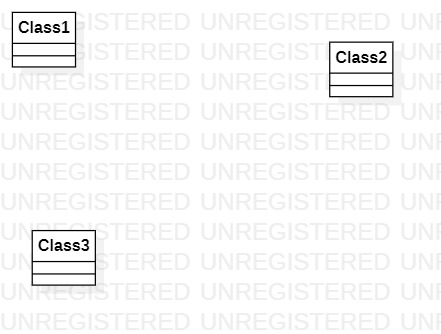

# 实验一

## 一、实验目标

1. 熟悉GitHub实验过程
2. 安装与使用StarUML

## 二、实验内容

- 安装Github并练习使用Git Bash
- 安装StarUML并创建一个图

## 三、实验步骤

1. 在Git官网上下载，安装git
2. 由于本地Git仓库和GitHub仓库之间的传输是通过SSH加密的，所以必须要让github仓库认证你SSH key，在此之前，必须要生成SSH key。
3. 为了方便版本控制，我们需要设置相应的用户明以及邮箱
```
    $ git config --global user.name "XXX"
    $ git config --global user.email XXX@XXX.com
```
4. 在老师的github仓库上进行fork,使用git clone 将fork过来的仓库下载到本地
5. 创建实验文档，用StarUNL建立一张uml图，导出为.jpg图片
6. 使用git add . 命令将有改动的文件夹添加到暂存区
7. 使用git commit 将暂存区里的改动提交到本地的版本库
8. 使用git push 将本地版本库推送到远程服务器中

## 四、实验结果

1. 画图



图1. 在StarUML上创建的第一个图
