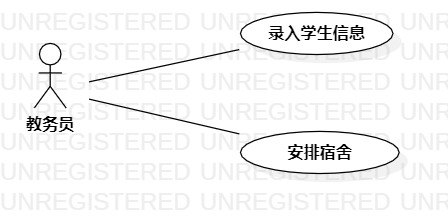

# 实验二：用例建模

## 一、实验目标

1. 细化功能需求
2. 画出用例图（Use Case Diagram）
3. 编写用例规约（表格）

## 二、实验内容

- 创建选题相关的用例图
- 编写实验报告文档
- 编写用例规约

## 三、实验步骤

1. 选题为学生宿舍管理系统
2. 根据自己选题内容在StarUML上创建用例图

    (1) 确定参与者：教务员
    
    (2) 添加用例：录入学生信息，安排宿舍
    
    (3) 建立参与者与用例的联系

3. 编写用例规约

    (1) 将GitHub上面的用例模板cope到自己的实验报告里
    
    (2) 编写录入学生信息用例规约
    
    (3) 编写安排宿舍用例规约

## 四、实验结果

### 1. 画图

图1. 学生宿舍管理系统的用例图

### 2. 用例规约

## 表1：录入学生信息用例规约  

用例编号  | UC01 | 备注  
-|:-|-  
用例名称  | 录入学生信息  |   
前置条件  | 教务员已登录,进入录入学生信息页面   | *可选*   
后置条件  |     | *可选*   
基本流程  | 1. 教务员输入学生学号、姓名；  |*用例执行成功的步骤*   
~| 2. 系统检查学生学号格式正确；  |   
~| 3. 系统查询到学生信息；   |   
~| 4. 教务员选择学院、班级；  |   
~| 5. 系统查询所有的学院、班级；  | 
~| 6. 教务员点击录入按钮；  | 
~| 7. 系统验证操作者信息；  |  
~| 8. 系统保存学生信息；  |  
~| 9. 提示"保存成功"。  | 
扩展流程  | 2.1 系统检查发现学生学号格式不正确，提示"学生学号格式不正确 "；   |*用例执行失败*    
~| 3.1 系统检查发现存在学生，提示"学生已存在"。   |
~| 7.1 系统检查发现操作者不是教务员，提示"权限不够"。   |

## 表1：安排宿舍用例规约  

用例编号  | UC02 | 备注  
-|:-|-  
用例名称  | 安排宿舍  |   
前置条件  | 教务员已登录，选中一位未安排宿舍的学生   | *可选*   
后置条件  |    | *可选*   
基本流程  | 1. 教务员点击安排宿舍按钮；  |*用例执行成功的步骤*   
~| 2. 教务员选择宿舍；|
~| 3. 系统查询所有空闲宿舍；|
~| 4. 教务员点击提交按钮；  |   
~| 5. 系统验证操作者信息；  |  
~| 6. 系统修改学生住宿状态、宿舍信息；  |  
~| 7. 提示"安排成功"。  | 
扩展流程  | 3.1 系统发现没有空闲宿舍，提示"无空闲宿舍"   |*用例执行失败*   
~| 5.1 系统检查发现操作者不是教务员，提示"权限不够"。   |