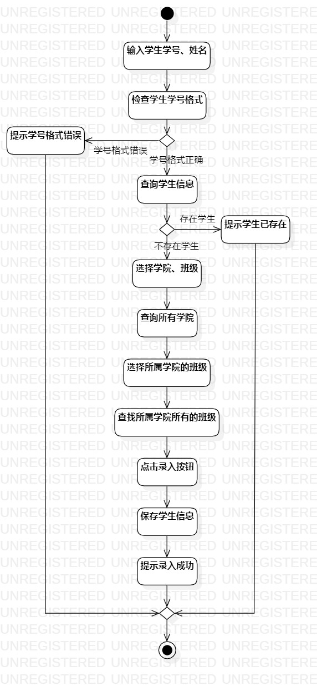
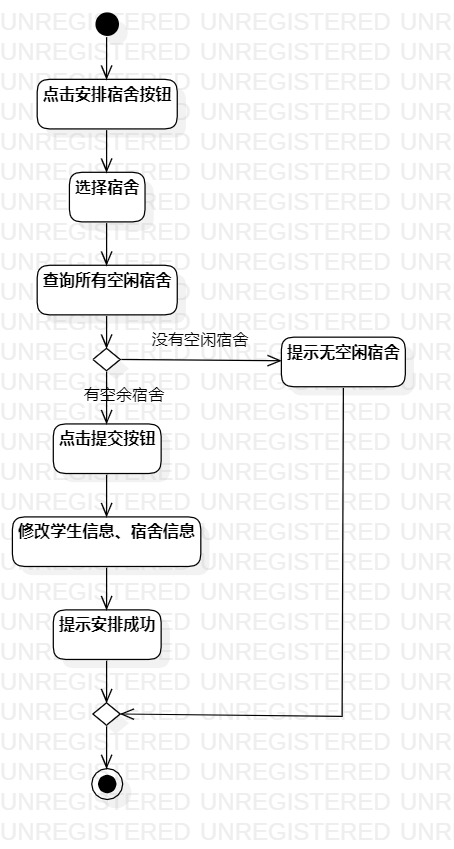

# 实验三：过程建模

## 一、实验目标

1. 掌握过程建模方法
2. 掌握活动图的画法（Activity Diagram）
3. 熟悉StarUML的基本功能

## 二、实验内容

- 使用StarUML根据自己的用例规约画出对应的活动图
- 编写实验报告文档

## 三、实验步骤

1. 将老师发布到百度的网盘全部看完

2. 根据自己的用例（录入学生信息和安排宿舍）新建两个活动图

    (1)  在活动图中，首先创建一个Initial表示开始状态；

    (2)  根据用例规约的过程，用一个Action表示活动状态，可以填写活动信息如点击按钮；

    (3)  Control Flow表示流程方向，将开始点和活动结点连接在一起；

    (4)  Decision表示判断，利用中会出现判断条件，进行分支；

    (5)  Merge表示合并，利用合并，能过清晰看见，活动最终会合并成一条主线。

    (6)  Final表示结束，用例最终结束。

3. 画完活动图后，要对活动图进行排版

    (1) 右键->Format->Alignment；

    (2) 进行水平对齐、居中对齐、垂直方向等距离排版。

3. 将两张活动图导出到对应的文件夹下。

## 四、实验结果

### 1. 活动图

图1. 录入学生信息活动图

图2. 安排宿舍活动图

## 五、实验心得
&nbsp;&nbsp;&nbsp;&nbsp;&nbsp;&nbsp;&nbsp;
在本次实验中，我已经掌握了StarUML的基本使用，包括活动图的每一个部件的使用、排版功能等等。同时，我能够对我的用例的基本活动流程，能够理解得清清楚楚，能够感受到UML的强大之处。