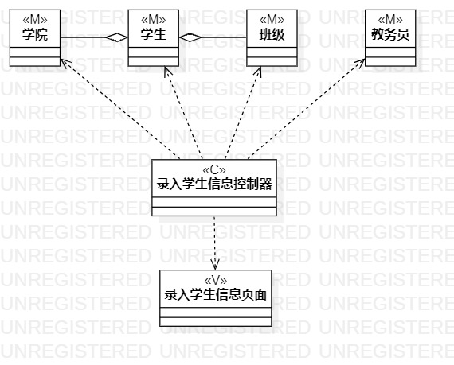

# 实验四、五：类建模

## 一、实验目标

1. 掌握类建模方法；
2. 了解MVC或你熟悉的设计模式；
3. 掌握类图的画法。
4. 掌握类之间关系的画法。
5. 理解类的5种关系.

## 二、实验内容

- 基于MVC模式设计类；
- 设计类的关系；
- 画出类图。

## 三、实验步骤

根据自己的用例，创建对应的类图：

1.创建第一个类图（录入学生信息类图）

&emsp;(1) 创建一个视图类(V):  录入学生信息页面。

&emsp;(2) 创建一个控制器类(controller): 录入学生信息控制器。

&emsp;(3) 由于录入对象是学生，而学生信息包含学院、班级，录入学生信息的动作是由教务员触发，因此创建四个模型类(model)：学生、学院、班级、教务员；
  
&emsp;(4) 然后给录入学生信息控制器类与录入学生信息页面类、学生类、学院类、班级类、教务员类添加依赖关系，给学生类和学院类、班级类添加包含关系。

2.创建第二个类图（安排宿舍类图）

&emsp;(1) 创建一个视图类(V):  安排宿舍页面。

&emsp;(2) 创建一个控制器类(controller): 安排宿舍控制器。

&emsp;(3) 由于录入对象是宿舍，宿舍包含学生学号，安排宿舍的动作是由教务员触发，因此创建三个模型类(model)：学生、宿舍、教务员；
  
&emsp;(4) 然后给安排宿舍控制器类与安排宿舍页面类、学生类、宿舍类、教务员类添加依赖关系，给宿舍类和学生类添加包含关系。

## 四、实验结果

### 1. 类图

图1. 录入学生信息类图

图2. 安排宿舍类图

## 五、实验心得

&emsp;&emsp;UML类图的作用是描述程序中类的信息及各个类之间的关系。在画UML之前，先要对面向对象的概念由所了解，不然很难将本次类图实验画出来。类之间的关系有继承关系，实现关系，依赖关系，关联关系，聚合关系，组合关系，要根据自己的用例来确定类之间的关系。