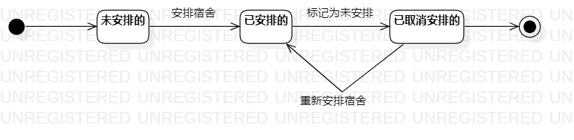

# 实验七：状态建模

## 一、实验目标

1. 掌握对象状态建模（状态图，Statechart）

## 二、实验内容

- 寻找一个关键的对象；
- 设计该对象的关键状态；
- 设计该对象的转变条件。

## 三、实验步骤

1. 根据自己的用例图、用例规约、活动图、类图、顺序图，选择学生作为关键的对象；

2. 找出学生的相关状态（未安排的、已安排的、已取消安排的），学生的开始状态为未安排的，教务员为学生安排宿舍后，学生的状态转变成已安排的，教务员也可以取消安排，学生的状态转变成已取消安排的，教务员需要重新安排宿舍，学生的状态就转变回已安排的。

3. 添加“Initial State”、“Final State”、“Simple State”，然后用连线连起来

## 四、实验结果

### 1. 学生状态图

图1. 学生状态图

## 五、实验心得
&emsp;&emsp;通过本次学习的状态图，我能够掌握UML的状态图的画法，同时也能够对用例与对象之间的关系有着深刻的理解，能够加强对本系统的认识。