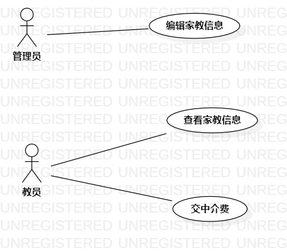

# 实验一

# 实验二： 用例建模

## 一.实验目标

1.创建并完善选题

2.了解并掌握用例图

3.进一步熟悉github的命令

## 二.实验内容

1.建立个人选题

2.绘制用例图

3.用github提交实验

## 三.实验步骤

1.确定系统功能
-上交中介费
-编辑家教信息
-查看家教信息

2.根据功能绘制用例图

3.建立之间联系

## 四。实验结果

  
图2 以上为用例图
