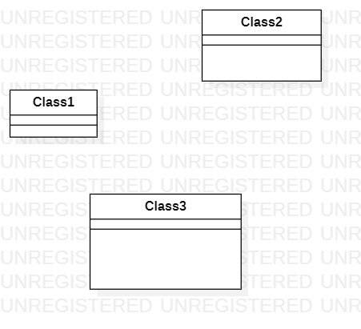

# 实验一

## 一、实验目标
1.初步掌握StarUML和GitHub
## 二、实验内容
1. 熟悉GitHub操作过程
2. 安装git和StarUML
3. 建立第一个UML模型图
## 三、实验步骤
1. 下载并安装Git和StarUML
2. fork项目到个人仓库
3. clone项目到本地
4. 创建并编辑lab1.md文档
5. 用StarUML创建UML图
6. git commit
7. 在GitHub上编辑实验文档，插入UML图
8. git push
9. pull request
## 四、实验结果
