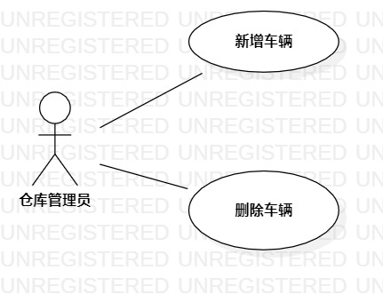

# 实验二：用例建模

## 一、实验目标
1. 创建并完善个人选题
2. 使用MarkDown编写报告
3. 了解并掌握用例图的画法
## 二、实验内容
1. 选题
2. 使用StarUML绘制个人选题的用例图
3. 编写实验二报告
## 三、实验步骤
1. 创建个人选题：汽车销售管理系统
2. 仓库管理员功能：
 - 新增车辆
 - 删除车辆
3. 根据选题及功能画图
 - 添加Actor：仓库管理员
 - 添加UseCase：新增车辆、删除车辆
 - 建立Actor与UseCase联系
4. 编写用例规范
## 四、实验结果
    
图1. 书店仓库管理系统的用例图

## 表1：新增车辆用例规约  

用例编号  | UC01 | 备注  
-|:-|-  
用例名称  | 新增车辆  |   
前置条件  | 客户预定车辆     | *可选*   
后置条件  |      | *可选*   
基本流程  | 1. 管理员点击新增车辆按钮  |*用例执行成功的步骤*    
~| 2. 系统弹出新增车辆页面  |   
~| 3. 管理员输入车辆信息（车辆编号、车辆型号、售价、车漆、车轮样式、内饰条、座椅材质），点击确认按钮  |   
~| 4. 系统检查信息的合法性，检测车辆编号，车辆型号不为空  |   
~| 5. 系统显示车辆信息页面  |  
扩展流程  | 4.1 系统检查发现车辆编号、车辆型号为空，提示“添加失败”  |*用例执行失败*    

## 表2：删除车辆用例规约  

用例编号  | UC01 | 备注  
-|:-|-  
用例名称  | 删除车辆  |   
前置条件  | 客户提走车辆     |   
后置条件  |      |   
基本流程  | 1. 管理员点击搜索车辆按钮，输入车辆型号或者车型  |*用例执行成功的步骤*    
~| 2. 系统根据搜索框信息查询并显示车辆信息页面  |   
~| 3. 管理员点击删除车辆按钮  |   
~| 4. 点击提示框“确认删除”  |   
~| 5. 删除成功，页面移除该车辆信息  |  
扩展流程  | 2.1 系统检查发现车辆编号、车辆型号为空，提示“车辆不存在”  |*用例执行失败* 

