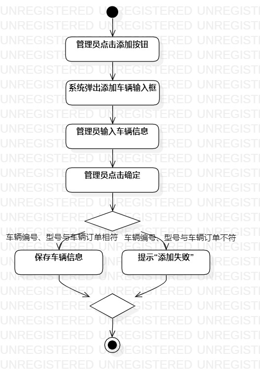
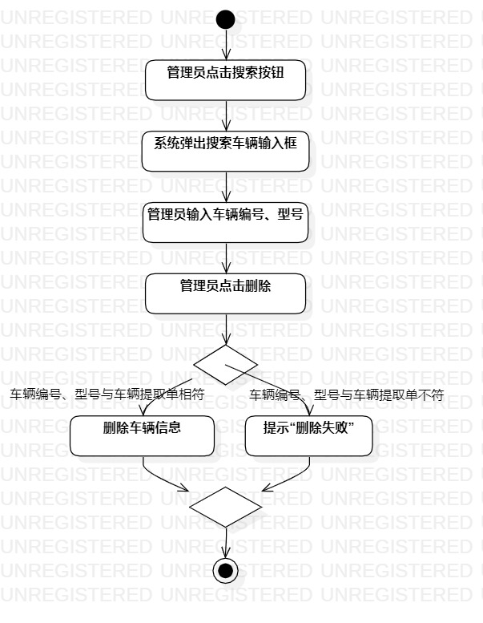

# 实验三：过程建模
## 一、实验目标
1. 掌握过程建模的方法
2. 掌握活动图的画法（Activity Diagram）
## 二、实验内容
使用StarUML根据实验二的用例规约画出相应的活动图
## 三、实验步骤
1. 仔细观看教学视频讲解
2. 根据用例规约创建“新增车辆”活动图
- 添加Atcion,说明操作
- 添加Decision，根据判断跳转
3. 根据用例规约创建“删除车辆”活动图
- 添加Atcion,说明操作
- 添加Decision，根据判断跳转
4. 导出活动图(.jpg)
5. 编写实验报告
## 四、实验结果

图1. 新增车辆活动图

图2. 删除车辆活动图
