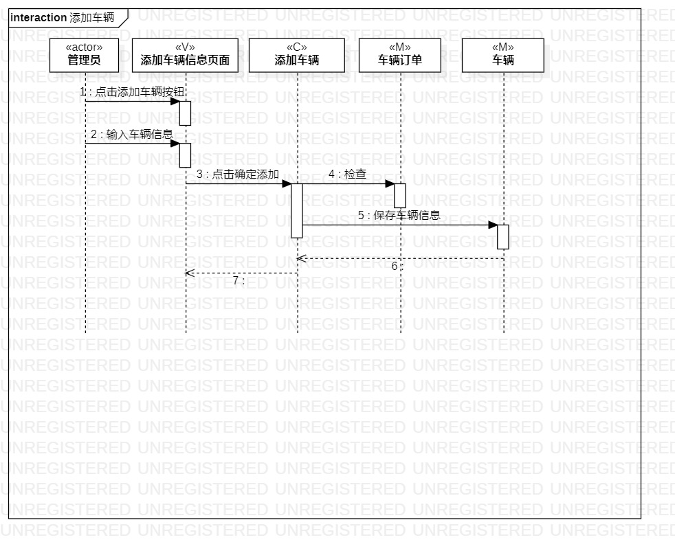
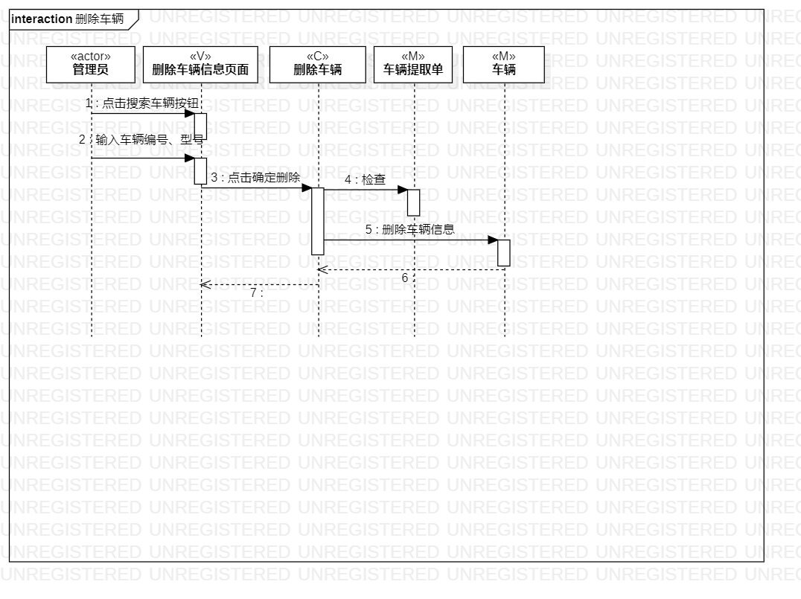

# 实验六

## 一、实验目标

1. 掌握交互建模方法。
2. 掌握顺序图的画法。（Sequence Diagram）

## 二、实验内容

1. 根据用例规约图、活动图、用例图、类图创建顺序图

## 三、实验步骤

1. 观看视频学习顺序图的知识  
2. 在画顺序图时，参考之前的用例规约、用例图以及类图，对不合理处进行修改  
3. 画“添加车辆”顺序图   
4. 画“删除车辆”顺序图  

## 四、实验结果
  
图1.添加车辆的顺序图

   
图2.删除车辆的顺序图

