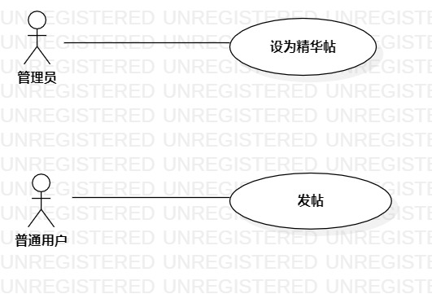

# 实验二   用例建模
## 一、实验目标

1. 学会使用Markdown编写实验报告  
2. 掌握用例的概念和用例建模

## 二、实验内容
1. 提交个人选题到Issues  
2. 用Markdown完成实验报告  
3. 用StartUML完成用例建模  

## 三、实验步骤  
1. 选题为“论坛系统”
2. 根据选题和所选功能在StarUML上创建用例图：   

3. 创建参与者：
	- 普通用户
	- 管理员

4. 创建用例
	- 设为精华贴
	- 发帖
5. 建立关系Association,，完成创建      
6. 编写用例规约  

## 四、实验结果

  
【图1】“论坛系统”用例图

## 表1：新增上网用户用例规约  

用例编号  | UC01 | 备注  
-|:-|-  
用例名称  | 设为精华贴                       |   
前置条件  | 管理员在管理页面登录成功，进入帖子管理页面 | *可选*   
后置条件  | 重定向到帖子管理页面 | *可选*   
基本流程  | 1.管理员点击目标帖子链接 |*用例执行成功的步骤*    
~| 2.系统显示目标帖子管理页面 |   
~| 3.管理员点击**设为精华**按钮 |   
~| 4.系统标记目标帖子为精华 |   
~| 5.系统提示“设置成功”。 |  
扩展流程  |  |*用例执行失败* 

用例编号  | UC02 | 备注  
-|:-|-  
用例名称  | 发帖                                                         |   
前置条件  | 普通用户已经登录，并进入首页 | *可选*   
后置条件  | 重定向到帖子的详情页面 | *可选*   
基本流程  | 1. 普通用户点击**我要发帖**按钮 |*用例执行成功的步骤*    
~| 2. 系统显示发帖页面 |   
~| 3. 普通用户在输入框输入帖子的标题跟内容，点击**发帖**按钮 |   
~| 4. 系统获取登录的普通用户的用户信息，检查此用户的发帖权限 |   
~| 5. 系统将登录的用户设为此贴作者，保存帖子 |  
~| 6. 系统在此用户已发表的帖子列表中，加入此帖子 |  
~| 7. 系统提示“发帖成功”。 |  
扩展流程  | 4.1 系统检查发现当前用户没有发帖的权限。 |*用例执行失败*    
