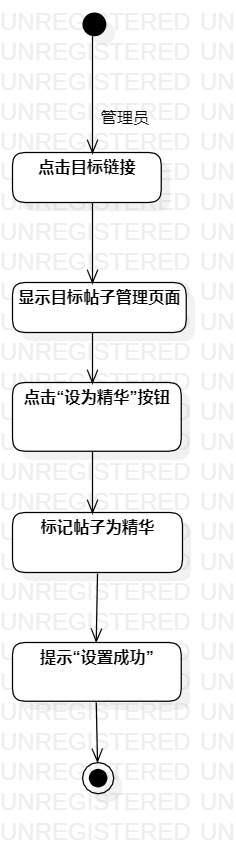
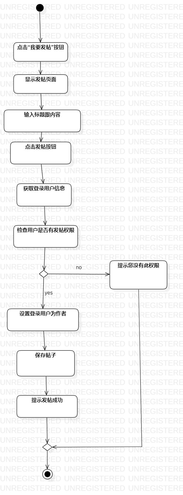
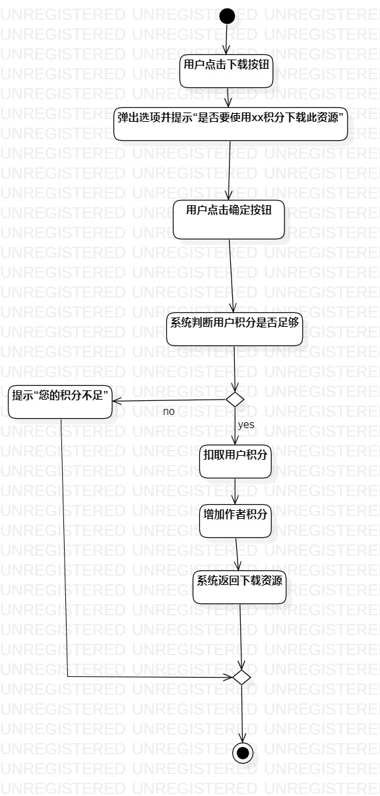

# 实验三：过程建模

## 1. 实验目标

- 掌握过程建模方法
- 掌握活动图的画法

## 2. 实验内容

- 利用StarUML画出活动图
- 熟悉活动图符号的用法和意义
- 编写实验报告

## 3. 实验步骤

1.观看教学视频学习StarUML

2.打开自己实验二的实验报告查看用例规约

3.根据设为精华贴用例规约画出用例的活动图

4.根据发帖用例规约画出用例的活动图

5.根据下载资源用例规约画出用例的活动图

6.编写实验报告

## 4. 实验结果

图1：设置精华贴的活动图

图2：发帖的活动图

图3：下载资源的活动图