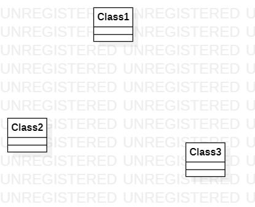

# 实验一

## 实验目标

1、下载并安装建模工具 StarUML，下载地址：http://staruml.io
2、确定个人建模选题，将选题填写在 Issues 中。

## 实验内容
1、完成工具的下载安装。
2、使用git进行下载、上传和在github上编辑修改。

## 实验结果

## 选题标题：记账小本本

### 功能
1、记录消费情况和金额
2、删除消费情况和金额
3、统计每周、每月、每年的消费金额
