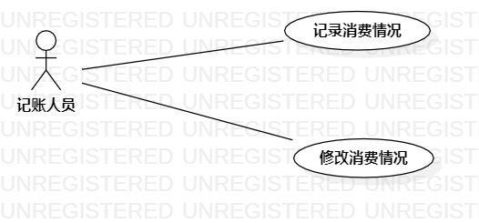

# 实验二：用例建模

### 1.实验目标

- 使用Markdown编写报告

- 细化选题

- 学习使用StarUML用例建模

  

### 2.实验内容

- 创建用例图

- 编写实验报告文档

- 编写用例规约

  

### 3.实验步骤

- 选题定为财务管理系统

- 确定系统是参与者与事件

- 确定参与者—记账人员

- 确定用例：

  —  记录消费情况

  —  删除消费情况

- 建立参与者与用例之间的关系

- 用StarUML绘制用例图

- 编写用例条约

  

### 4.实验结果

​                                                                图1：财务管理系统用例图
保存

### 表1：记录消费情况用例规约  

| 用例编号 | UC01                                     | 备注               |
| -------- | ---------------------------------------- | ------------------ |
| 用例名称 | 记录消费情况                             |                    |
| 前置条件 | 记账人员已成功登录系统，进入消费列表页面 | 可选               |
| 后置条件 |  系统返回消费列表页面                                       | 可选               |
| 基本流程 | 1.记账人员点击“添加”按钮；                 | 用例执行成功的步骤 |
|          | 2.系统转入信息填写页面；                 |                    |
|          | 3.记账人员记录消费内容和消费金额，点击“确定”按钮；       |                    |
|          | 4.系统检查输入不为空，保存消费内容和金额；           |                    |
|          | 5.系统弹出“保存成功”提示信息；                 |                    |
| 扩展流程 |3.1.系统检查输入为空，提示“输入为空，请重新输入”。 | 用例执行失败       |

### 表2：删除消费情况用例规约  

| 用例编号 | UC02                                     | 备注               |
| -------- | ---------------------------------------- | ------------------ |
| 用例名称 | 删除消费情况                             |                    |
| 前置条件 | 记账人员已成功登录系统，进入消费列表页面 | 可选               |
| 后置条件 | 系统返回消费列表页面                                         | 可选               |
| 基本流程 | 1.记账人员点击“删除”按钮；                 | 用例执行成功的步骤 |
|          | 2.系统转入信息删除页面；                 |                    |
|          | 3.记账人员选择一条消费情况和金额记录；       |                    |
|          | 4.系统弹出“确定删除”提示框；           |                    |
|          | 5.记账人员点击“确定删除”按钮；                 |                    |
|          | 6.系统检查所选记录，标记所选记录为删除；               |                    |
|          | 7.系统弹出“删除成功”提示信息。                 |                    |
| 扩展流程 |  6.1 系统检查所选记录不存在，提示“该记录不存在，请重新选择”。                                       | 用例执行失败       |

 

