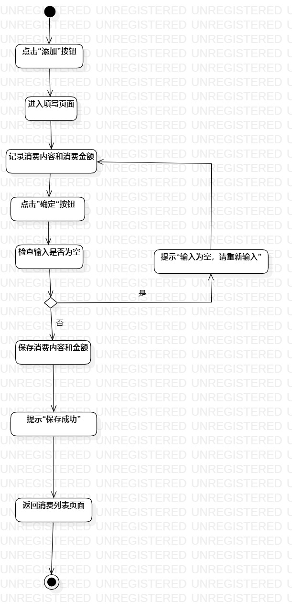
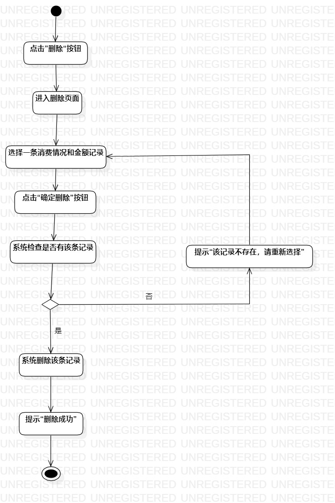

## 实验三：用例建模

### 一、实验目标

1、掌握过程建模的方法

2、掌握活动图的画法

### 二、实验步骤

1、确定两个用例：记录消费情况，删除消费情况

2、对记录消费情况用例进行建模

3、对删除消费情况用例进行建模

### 三、实验结果

图1、用例记录消费情况的过程建模图                   

图2、用例删除消费情况的过程建模图                
