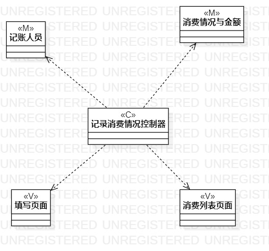
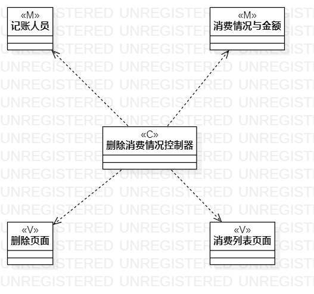

# 实验五：高级类建模

### 一、实验目标

1、掌握类的概念和构成

2、掌握类建模方法

3、了解MVC设计模式

4、理解类的五种关系

5、掌握类之间关系的画法（class diagram)

### 二、实验内容

1、学习掌握类建模的方法

2、学习MVC设计模式

3、根据用例规约绘制相应的类图

——记录消费情况类图

——删除消费情况类图

### 三、实验步骤

1、确定使用MVC设计模式

2、通过用例规约找出类、页面还有控制器

3、在StarUML中绘制类图

——记录消费情况类图

——删除消费情况类图

4、根据MVC设计模式确定类的关系

### 四、实验结果

图1、记录消费情况类图

图2、删除消费情况类图

